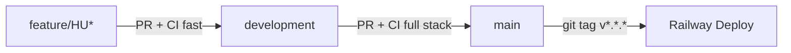

# CI/CD Pipeline

## Overview

Este documento describe el pipeline de CI/CD de `arch-agent` y cómo interactuar con él. La estrategia tiene dos ejes: **rapidez en PRs de feature** (tests rápidos con un Postgres efímero) y **confianza cerca de release** (stack completo de Docker Compose + smoke check en PRs a `main`). El deploy a producción está desacoplado del flujo de PRs: nunca deploya al mergear a `main`, solo cuando se pushea un tag semver.

El pipeline usa GitHub Actions con tres workflows en `.github/workflows/`: `pr-development.yml` para PRs contra `development`, `pr-main.yml` para PRs contra `main` (full-stack), y `deploy-railway.yml` para releases taggeadas. Los tests siguen la convención de commits del repo y OpenSpec sigue siendo la fuente de verdad para cambios de comportamiento.

## Branch Flow

| Branch | Trigger | Workflow | Qué corre |
|--------|---------|----------|-----------|
| `feature/HU*` | push a `development` (PR abierta) | `pr-development.yml` | `pytest` contra Postgres `postgres:16-alpine` como service container (rápido) |
| `development` | PR abierta contra `main` | `pr-main.yml` (job `test`) | `docker compose up` del stack completo (postgres-app + engram + langfuse-web + deps), luego `pytest` |
| `main` | PR abierta contra `main` (job `smoke`) | `pr-main.yml` (job `smoke`) | `python -c "from server import app"` — import sanity check |
| `main` | `git push --tags v*.*.*` | `deploy-railway.yml` | `railway up --detach` con `RAILWAY_TOKEN` |

## Visual Diagram



## Required GitHub Secrets

Configuralos en: **Settings → Secrets and variables → Actions → New repository secret**.

| Secret | Propósito | Obligatorio | Dónde obtenerlo |
|--------|-----------|-------------|-----------------|
| `RAILWAY_TOKEN` | Auth para `railway up` durante deploys taggeados | **Sí** (para releases) | https://railway.app/account/tokens → Create Token |
| `LANGFUSE_PUBLIC_KEY` | Autentica el backend con Langfuse | Solo para PR-main full-stack / producción | Langfuse UI → Settings → API Keys (`pk-lf-...`) |
| `LANGFUSE_SECRET_KEY` | Pareja de la pública, nunca se loggea | Solo para PR-main full-stack / producción | Langfuse UI → Settings → API Keys (`sk-lf-...`) |
| `ENGRAM_API_KEY` | Auth para Engram HTTP API en producción | Producción (no usado en CI actual) | `gentle-ai engram token create` o dashboard Engram |
| `OPENAI_API_KEY` | Para tests E2E que pegan contra OpenAI | Tests E2E futuros | https://platform.openai.com/api-keys |
| `JWT_SECRET` | Override del secret de testing para suites que validan JWT | Solo si removés el default en `tests/conftest.py` | `python -c "import secrets; print(secrets.token_urlsafe(32))"` |
| `DATABASE_URL_TEST` | Override opcional del `DATABASE_URL` para usar un Postgres hosted (Neon/Supabase) en vez del service container efímero | Opcional | Tu provider de Postgres |

> **Tip:** Si todavía no tenés secrets configurados, los workflows `pr-development.yml` y `pr-main.yml` van a funcionar igual — usan defaults hardcodeados o fixtures (`tests/conftest.py` setea `JWT_SECRET_KEY` automáticamente). Los secrets son para endurecer el pipeline o habilitar E2E.

## How to cut a release

```bash
# 1. Asegurate de estar en main con todo mergeado y green
git checkout main
git pull --rebase

# 2. Creá el tag semver
git tag v0.1.0

# 3. Push del tag (esto dispara deploy-railway.yml)
git push --tags

# 4. Verificá el deploy
#   - GitHub Actions: pestaña Actions → workflow "Deploy to Railway" → debe estar verde
#   - Railway: https://railway.app → tu proyecto → ver el deploy en curso
```

Convención de tags: `vMAJOR.MINOR.PATCH` (SemVer). Ejemplos válidos: `v0.1.0`, `v1.4.2`, `v2.0.0-rc.1`.

## How to roll back

Railway mantiene historial de deploys y permite rollback en un click desde el dashboard.

**Opción A — Rollback vía Railway UI (recomendado):**
1. Ir a https://railway.app → proyecto → Deployments
2. Buscar el deploy anterior que estaba funcionando
3. Click → "Redeploy"

**Opción B — Re-tag con versión anterior:**
```bash
git tag v0.0.9 <commit-sha-del-release-anterior>
git push --tags --force
```
El workflow `deploy-railway.yml` re-dispara con ese tag. Útil si querés que el tag en `main` refleje exactamente qué versión está corriendo.

**Opción C — Revertir el commit y tag nuevo:**
```bash
git revert <commit-del-bug>
git tag v0.1.1
git push --tags
```

## Branch Protection Checklist

Estas reglas se setean en **GitHub → Settings → Branches → Add rule**. El pipeline NO las enforza por sí solo — son configuración del repo.

### `development`

- [ ] Require a pull request before merging
- [ ] Require approvals: **0** (es staging, dejamos merge rápido)
- [ ] Dismiss stale pull request approvals when new commits are pushed
- [ ] Require status checks to pass before merging
  - [ ] `test` (del workflow `PR - Development`)
- [ ] Require linear history
- [ ] Do not allow force pushes
- [ ] Do not allow deletions

### `main`

- [ ] Require a pull request before merging
- [ ] Require approvals: **1** mínimo
- [ ] Dismiss stale pull request approvals when new commits are pushed
- [ ] Require status checks to pass before merging
  - [ ] `test` (del workflow `PR - Main`)
  - [ ] `smoke` (del workflow `PR - Main`)
- [ ] Require linear history
- [ ] Include administrators (nadie esquiva las reglas, ni el owner)
- [ ] Do not allow force pushes
- [ ] Do not allow deletions
- [ ] Allow auto-merge: **off** (querés review explícito antes de taggear)

### Reglas globales sugeridas

- Default branch: `main`
- Restringir quién puede pushear tags `v*.*.*` a un team de maintainers (no se puede enforcear via branch protection, pero se puede auditar con `gh api repos/:owner/:repo/tags`)
