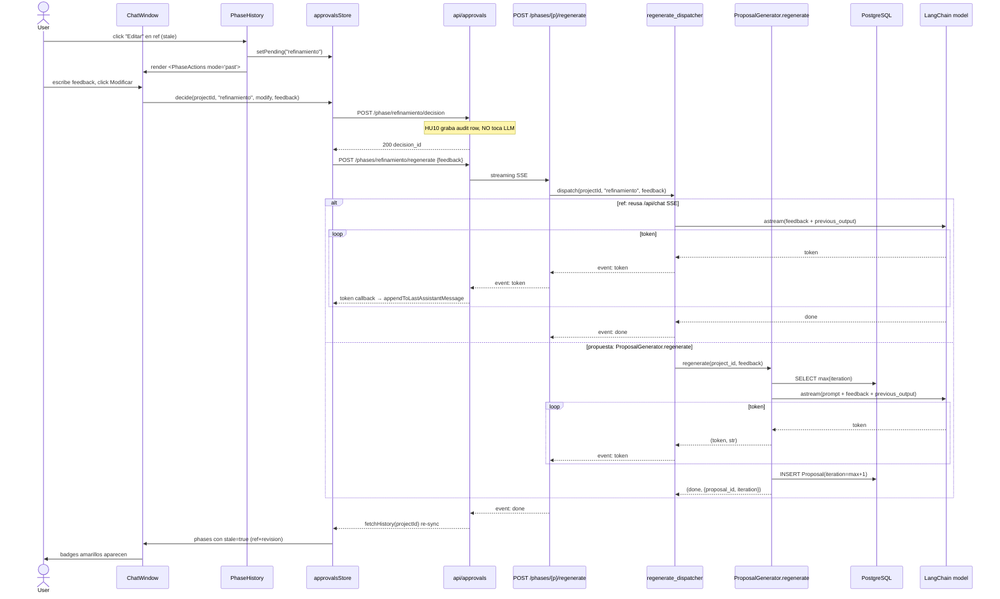

# ADR-015: HU11 — Ajuste quirúrgico por fase sin perder progreso

**Fecha:** 2026-09-18
**Estado:** Accepted (implementación completa T1-T9 cerrada en `feature/hu11-surgical-adjustment`)
**Decisor:** Daniel
**Issue:** [#22 — [HU11] Ajuste puntual sin perder progreso](https://github.com/danielCH26/arch-agent/issues/22)
**Change:** `hu11-surgical-adjustment`
**ADRs previos referenciados:** ADR-014 (HU10 phase gate), ADR-009 (patrón SSE), ADR-008 (source of truth relacional F08), ADR-011 (espejo Engram)

## Contexto

El issue #22 pide que el equipo cliente pueda pedir un ajuste puntual sobre **una fase específica** del flujo sin perder el progreso de las fases anteriores ya aprobadas. Los cuatro criterios de aceptación son:

1. El usuario puede **especificar qué etapa modificar**.
2. Las **etapas aprobadas previamente se mantienen**.
3. Solo se **regenera la etapa afectada**.
4. El **feedback del usuario se incorpora** a la regeneración.

HU10 (`feature/hu10-staged-approvals`, PR #78 en revisión) sentó las bases:

- `phase_decisions.record_decision` (`app/core/phase_decisions.py:146`) acepta decisiones sobre cualquier fase de `AVAILABLE_PHASES`, sin importar `project.current_phase` (REQ-SA-5 reconciliada en commit `bbbfc4e`).
- `approvals.previous_output JSONB` (migration 0015) persiste snapshot del contenido previo por fase.
- `approvalsStore.setPending(phase)` (`frontend/src/stores/approvalsStore.ts:110`) está tipada pero **sin callers** — el frontend nunca la dispara.
- 60s idempotency window + 409 por fase (`IDEMPOTENCY_WINDOW_SECONDS = 60` en `app/core/phase_decisions.py:54`).
- `<PhaseActions>` se monta solo cuando `pendingForCurrentPhase` es no-null (`frontend/src/components/ChatWindow.tsx:81-84`), así que el botón "Modificar" de fases pasadas **no tiene punto de entrada en la UI**.

Quedan **cuatro gaps duros** para HU11:

1. **Sin UI para Modify en fases pasadas.** `<ChatWindow>` solo renderiza `<PhaseActions>` para `current_phase`. El usuario no puede invocar `setPending(phase)` desde ningún lado.
2. **Sin ruta de regeneración LLM para fases pasadas.** F08 `/api/proposals/{id}/modify` (`app/api/proposals.py:164-238`) hace 409 cuando `lifecycle != "proposed"` — toda propuesta aprobada queda fuera de alcance. F05 `/api/elicitation/decision` (`app/api/elicitation.py:211-296`) borra `engram_state` en modify, así que si la llaman fuera de `requerimientos` pisa el resumen previo. `refinamiento` no tiene endpoint dedicado.
3. **Sin snapshot estructurado para `requerimientos` y `refinamiento`.** `_build_previous_output` (`app/core/phase_decisions.py:327-370`) retorna `{}` para ambas porque su contenido LLM-streamed vive en `engram_state` y `messages.attachments` respectivamente, no en columnas JSONB accesibles.
4. **Sin señal de "stale" en fases posteriores.** Si modifico `propuesta` ya aprobada, `refinamiento` y `revision` siguen marcadas como `approved` aunque su contenido deriva de la versión vieja. No hay forma de saberlo desde `GET /phases`.

Los 4 ACs del issue se incumplen literalmente hoy.

## Decisión

**Approach A + D híbrido** (de `explore.md §3`):

### 1. Un endpoint nuevo, no modificar los legacy

`POST /api/projects/{id}/phases/{phase}/regenerate` (SSE, mismo shape que `/api/chat` y `/api/proposals/{id}/modify`: `event: sources | token* | done | error`). Body `{feedback: str, payload?: object}`. La decisión sigue en `POST /phase/{phase}/decision` (HU10 canónico); HU11 solo dispara el LLM side-effect **después** de que la decisión quedó registrada.

Esto mantiene dos invariantes:

- **El audit row de la decisión (`approvals` + `interaction_logs`) queda escrito antes de cualquier llamada al LLM.** Si el LLM falla, la decisión del usuario persiste y puede re-disparar el regenerate sin perder contexto.
- **El contrato HTTP de F05/F08 no se toca.** `/api/proposals/{id}/modify` sigue 409 si `lifecycle != "proposed"` (REQ-PA-HU11-3 preservado).

### 2. `ProposalGenerator.regenerate()` interno, no aflojar F08

El bypass del 409 de F08 se hace en la **capa de dominio**, no en el endpoint HTTP. Se agrega un método async `ProposalGenerator.regenerate(project_id, feedback)` en `app/core/proposal_generator.py` que calcula `iteration = max(iteration for project_id) + 1` independientemente del `lifecycle` de la propuesta previa (REQ-PA-HU11-1). Reutiliza `_persist_proposal_and_log` (líneas 450-542) para que el cap `PROPOSAL_MAX_ITER` siga aplicando sin cambios. La ruta HTTP nueva llama a este método; `/api/proposals/{id}/modify` legacy sigue intacto.

Riesgo evitado: si aflojamos el 409 de F08, rompemos a cualquier consumidor legacy que dependa del 409 como señal de "esta propuesta está cerrada". El bypass a nivel de generador concentra el cambio en un solo método nuevo.

### 3. Dispatch per-fase (tabla completa)

| Fase | Mecanismo | Storage target | previous_output |
|------|-----------|----------------|-----------------|
| `requerimientos` | Re-invoca `elicitation_agent.next_step` + `generate_summary` con feedback; stream SSE del nuevo resumen | `engram_state[<project_id>]["requerimientos"]["resumen"]` (existing F05 path) | `{"resumen": <prior>}` desde `engram_state` |
| `propuesta` | `ProposalGenerator.regenerate(project_id, feedback)`; `iteration = max+1` sin chequear lifecycle; tokens streamean al proposal timeline | Nueva fila `Proposal` + dual-write a `proposal_approvals` | `{content, citations, iteration}` del `_latest_proposal` |
| `refinamiento` | Reusa `/api/chat` SSE con feedback como mensaje; F11 agent decide si invocar `puppeteer_screenshot` | Nueva `Message(role="assistant")` row + attachments | `{"attachments": [...]}` desde último `Message.attachments` |
| `revision` | **No-op**: el edit UI ya quedó hecho por `<PhaseFeedbackComposer>`. Retorna 200 con `{regenerated: false}` | — | `{patron_elegido, ventajas, desventajas}` desde el payload |
| `final` | **409** "Modify not allowed on `final` phase" (REQ-SA-8) | — | — |

### 4. Stale marker calculado en lectura, sin nueva columna

`GET /api/projects/{id}/phases` agrega `stale: bool` a `PhaseStatusItem` (REQ-SA-26). Para fase `p`, `stale = true` si:

1. `p < current_phase`, Y
2. existe fila `approvals` con `decision="modify"` y `created_at > latest "approve" para cualquier fase q > p`.

Pure Python loop sobre `approval_rows` ya fetched en `list_phases` (`app/api/projects.py:421-505`). Sin SQL nuevo, sin migration, sin índice extra. La bandera es **advisory**, no destructiva: nunca borra ni cambia approvals; el frontend la pinta como badge amarillo ⚠ y el usuario decide si re-aprueba o no.

### 5. F05 past-phase guard

`POST /api/elicitation/decision` (`app/api/elicitation.py:211-296`) recibe un guard al inicio: si `project.current_phase != "requerimientos"`, retorna 409 inmediatamente. Esto evita que un caller legacy (script de seed, otra rama frontend) pise `engram_state` con `resumen=None` cuando el proyecto ya está en `propuesta` o más allá. Contrato F05 actual preservado para callers que sí operan en `current_phase="requerimientos"`.

### 6. Concurrency y transporte

Mirror literal de HU10: `IDEMPOTENCY_WINDOW_SECONDS = 60` por `(session_id, phase)`. Doble-click con misma feedback → 200 idempotent. Doble-click con feedback distinta → 409 con `current_decision`. **No hay lock cross-phase**: modificar `requerimientos` y `propuesta` en paralelo sigue funcionando (cada fase tiene su propia ventana).

Transporte: **SSE puro** (no JSON-then-SSE). Razones: (a) la latencia LLM es 5-30s — un JSON 200 inicial dejaría al usuario sin feedback; (b) `<PhaseActions mode='past'>` ya muestra un banner "Regenerando..." que combina natural con streaming; (c) el shape `event: sources | token* | done | error` es idéntico al de `/api/chat` y `/api/proposals/{id}/modify`, así que el `dispatchSSEEvent` del cliente no necesita rama nueva. El frontend aborta con `AbortController` en unmount, mismo patrón que `chatStore.ts:50-129`.

### 7. Sin nueva migration

`_build_previous_output` extendido (REQ-SA-27) lee:

- `requerimientos`: `engram_state[<project_id>]["requerimientos"]["resumen"]` vía `session_store.load_session_state(user_id)`.
- `refinamiento`: última fila `Message(role="assistant", attachments IS NOT NULL)` con `session_id = ? AND project_id = ?` ordenada por `created_at DESC LIMIT 1`.

Si la fuente no existe (e.g., reject previo limpió `engram_state`), retorna `{}` y el LLM regenera solo con `feedback`. No crash, no migration, no nueva columna.



## Consecuencias

### Positivas

- **Cero nueva migration.** `_build_previous_output` se extiende in-place; `stale` se computa en lectura; el `regenerate()` interno evita tocar el CHECK constraint ni el `lifecycle` de F08. Diff de DB: vacío.
- **Litera cumplimiento de los 4 ACs del issue.** Cada uno mapea a un artefacto verificable: AC1→endpoint con path param `phase`; AC2→auditoría preservada (nunca se borra `approvals`); AC3→dispatch table (solo se re-prompt la fase afectada, el resto sigue en `proposal_approvals` intacto); AC4→feedback inyectado en `previous_output` antes del LLM call.
- **Backwards compatible con F05/F08.** Los endpoints legacy siguen devolviendo los mismos status codes; HU11 agrega una superficie nueva, no modifica la vieja.
- **Audit row ortogonal al LLM.** Si el LLM falla mid-stream, la decisión del usuario sobrevive. El frontend muestra "Reintentar" (REQ-SA-25.4); el usuario no pierde contexto.
- **Catch del bug del `_FakeSession` de HU10.** El primer set de tests donde `project.current_phase != phase` está en `tests/core/test_phase_decisions.py::TestPastPhaseModify` (HU10 verify-report WARNING (b) lo señaló). HU11 lo cierra.
- **Predecible para F11 agent runtime.** `refinamiento` regenerate reusa `/api/chat` SSE; el F11 agent decide independientemente si invocar `puppeteer_screenshot`. No hay side-channel que duplique lógica de tool-calling.

### Negativas

- **Latencia LLM visible para el usuario.** 5-30s para regenerar `propuesta` o `requerimientos`. Mitigación: SSE streaming + banner "Regenerando..." + `AbortController` para cancelar. Aceptable porque el audit row ya está escrito cuando el usuario decide cancelar.
- **Dos endpoints por flujo de modify.** HU10 graba la decisión, HU11 regenera el LLM. Si el frontend dispara solo el segundo (sin el primero), el `previous_output` snapshot queda desincronizado. Mitigación: `<PhaseActions mode='past'>` invoca `decide()` (HU10) y, si responde 200, automáticamente `regeneratePhase()` (HU11) — el flujo es atómico desde la UI.
- **Stale marker es advisory, no enforcement.** El usuario puede ignorar el badge ⚠ y seguir trabajando con fases marcadas stale. Mitigación: tooltip "puedes re-aprobar para refrescar" + el badge nunca es rojo (solo amarillo). Si el feedback es ignorado, no hay corrupción — solo información obsoleta.
- **`_build_previous_output` extendido acopla `phase_decisions` con `session_store` y `Message`.** Mitigación: las nuevas lecturas están gated por `phase in {"requerimientos", "refinamiento"}`; el resto del helper sigue idéntico. Aceptable.
- **Sin lineage FK `parent_decision_id`.** No podemos graficar "este `approve` vino del `modify` de X". Mitigación: `interaction_logs` por decisión es suficiente audit para v1; deferred explícito en proposal §14 Q7.
- **Decisión de "stale" mira solo `modify` rows.** Si el usuario hace `reject` sobre una fase pasada, esa fase queda `rejected` (status pending, no stale). No es bug — el status `pending` ya indica que requiere acción.

### Neutrales

- **`final` mantiene Modify deshabilitado.** Coherente con REQ-SA-8. La 409 de `/regenerate` lo explicita.
- **Frontend `<PhaseHistory>` es un nuevo componente top-level.** No reusa `<PhaseActions>` (que tiene mount condition de current-phase); es ortogonal y queda aislado en `frontend/src/components/PhaseHistory/`.
- **`regeneratePhase` action del store es similar a `decide`.** Decide si fusionarlas. Decidido: separar. `decide` es JSON-200-ok-atomic; `regeneratePhase` es SSE-long-running. Mezclarlas complicaría el manejo de 409 (decide) vs stream-error (regenerate).

## Alternativas consideradas

### Approach B — Endpoints per-fase (`/elicitation/regenerate`, `/proposals/regenerate`, `/refinamiento/regenerate`)

Rechazado en `explore.md §3`. Tres URLs, tres SSE streams, tres handlers de error, per-phase dispatch frontend frágil. Más LoC (~500-700) sin ventaja funcional sobre un endpoint genérico que dispatcha internamente. Se prefiere el switch del backend (un solo punto de cambio si el día de mañana se agrega una fase 6).

### Approach C — Cascade-rollback: modify en fase pasada borra approvals posteriores

Rechazado por violación literal del AC2. Borrar filas `approvals` aprobadas para "resetear el flujo" destruye audit y contradice el pedido del issue. La decisión del usuario **es** preservar el progreso anterior; HU11 expone qué fases posteriores pueden estar desactualizadas vía el badge ⚠ en vez de borrarlas.

### Relajar F08 `/proposals/{id}/modify` lifecycle 409 (aflojar el endpoint HTTP)

Rechazado. Riesgo de regresión para consumidores legacy (F08 frontend branch `feature/F08-s2-frontend`, scripts de seed, futuros lectores). El bypass a nivel de `ProposalGenerator.regenerate()` (REQ-PA-HU11-1) concentra el cambio en un método nuevo sin tocar el contrato. Si el día de mañana F08 frontend también necesita past-phase modify, se discute por separado.

### Nueva migration con `approvals.stale BOOLEAN DEFAULT FALSE`

Rechazado. `stale` es derivado (computable de `approvals.created_at` + `approvals.decision`). Almacenarlo introduce riesgo de drift entre el flag y la realidad (¿cuándo se actualiza? ¿al insertar cada modify? ¿al re-approve?). Calcular en lectura con un loop de O(fases × rows) es trivial y siempre correcto.

### Cascade regeneration: regenerate de fase pasada re-prompt todas las downstream

Rechazado en `explore.md §3 Approach C`. Costo LLM 4× para un ajuste "puntual", rompe el AC3 ("solo se regenera la etapa afectada"), y abre UX вопрос: ¿qué hago si LLM downstream falla? El usuario pidió un cambio puntual — no le interesa esperar 4 generaciones.

### Endurecer `phase_decisions.record_decision` para validar `phase >= current_phase`

Rechazado. ADR-014 §"K check reconciliación `bbbfc4e`" documentó la decisión de aceptar decisiones en cualquier fase. Endurecerlo ahora revertiría la reconciliation y rompería el path existente que HU11 necesita. La corrección es aflojar F05/F08 por separado (lo que HU11 hace) sin tocar HU10.

## Referencias

- Issue [#22](https://github.com/danielCH26/arch-agent/issues/22).
- `openspec/changes/hu11-surgical-adjustment/explore.md` (Engram id 90).
- `openspec/changes/hu11-surgical-adjustment/proposal.md` (Engram id 91).
- `openspec/changes/hu11-surgical-adjustment/spec.md` (5 REQs, 13 SCNs).
- `openspec/changes/hu11-surgical-adjustment/specs/proposal-approval/spec.md` (3 REQs, 8 SCNs).
- HU10: `openspec/changes/hu10-staged-approvals/{explore,proposal,spec,design}.md` + `docs/adr/014-hu10-phase-gate.md`.
- Code anchors: `app/core/phase_decisions.py:146, 327-370, 54`; `app/api/projects.py:325-418, 421-505`; `app/api/elicitation.py:211-296`; `app/api/proposals.py:164-238`; `app/core/proposal_generator.py:53-256`; `app/models/session.py:1-14`; `frontend/src/stores/approvalsStore.ts:110-114, 78-200`; `frontend/src/components/ChatWindow.tsx:34-152`; `frontend/src/api/approvals.ts:1-103`.
- Tests fixtures: `tests/core/test_phase_decisions.py:122-163` (`_make_session` con `current_phase = phase` por defecto — gap que HU11 corrige con `TestPastPhaseModify`).
- Rama base: `feature/hu10-staged-approvals` HEAD `2c19482` (PR #78, en revisión). HU11 stacked PR #79.

## Manual smoke recipe (HU11 end-to-end)

Sigue este flujo en Docker Compose con un LLM real antes de pedir review del PR. Replica literal el happy-path + los 3 caminos de fallo más comunes. Ver `scripts/manual_smoke_hu11.md` para el detalle paso a paso; este resumen queda en el ADR para referencia rápida durante code review.

### Happy path (5 fases + edit pasada)

1. Login con un usuario de prueba; crear un proyecto nuevo.
2. Completar la elicitación (5+ turnos), aprobar → `phase_ready=True`, `current_phase=propuesta`.
3. Generar propuesta, aprobar → `current_phase=refinamiento`.
4. Refinamiento: enviar un mensaje que dispare `puppeteer_screenshot`, aprobar → `current_phase=revision`.
5. Revisión: elegir patrón + ventajas/desventajas, aprobar → `current_phase=final`.
6. Aprobación final: aprobar → `phase_ready=True`, archive.

### Surgical adjustment

7. Volver al proyecto una vez archivado (o reabrir manualmente el `current_phase=final`): GET `/api/projects/{id}/phases` debe devolver 5 filas con `stale: false`.
8. UI: click `Editar` en la fila de `propuesta` → debería montar `<PhaseActions mode='past'>` con banner y botón `Regenerar`.
9. Escribir feedback `agregar capa de cache` → click `Regenerar` → SSE stream emite tokens, `event: done` con `{"proposal_id": N+1, "iteration": 3}`.
10. GET `/api/projects/{id}/phases` debe mostrar:
    - `propuesta.stale=false` (es la fase modificada, no downstream)
    - `refinamiento.stale=true` ⚠
    - `revision.stale=true` ⚠
    - `final.stale=false`
11. Re-aprobar `propuesta` → `propuesta.current_decision.action='approve'`. La fila `approvals` previa (`decision='modified'`) sigue presente en la tabla.

### Fallos que SÍ deben manejarse limpios

- **Doble-click en Regenerar dentro de 60s**: el segundo POST debe retornar 200 idempotent (mismo `decision_id`) o 409 con `{current_decision, decided_at}` (REQ-SA-29.1).
- **LLM rate-limit mid-stream**: el SSE emite `event: error` con mensaje legible; el frontend muestra banner "Reintentar"; la fila `approvals` previa NO se borra (REQ-SA-25.4).
- **POST a `/api/elicitation/decision` cuando `current_phase != "requerimientos"`**: 409 inmediato sin tocar `engram_state` (REQ-SA-28 / SCN-SA-28.1).
- **POST a `/api/projects/{id}/phases/final/regenerate`**: 409 "Modify not allowed on final phase" (REQ-SA-8).
- **POST a `/phases/refinamiento/regenerate` con `current_phase=requerimientos`**: 409 "phase ahead of current_phase".

### Comprobaciones SQL después del smoke

```sql
-- Audit row preservada después de regenerate fallido
SELECT id, phase, decision, feedback, previous_output, created_at
FROM approvals
ORDER BY id DESC LIMIT 10;

-- proposal_approvals dual-write intacto (F08 legacy readers)
SELECT pa.id, p.iteration, pa.decision, pa.previous_output
FROM proposal_approvals pa
JOIN proposals p ON p.id = pa.proposal_id
WHERE p.project_id = <id>
ORDER BY pa.created_at DESC;

-- engram_state resumen se actualizó tras regenerate de requerimientos
SELECT engram_state->'1'->'requerimientos'->'resumen'
FROM sessions WHERE user_id = <uid>;
```

### Métricas de éxito

- Tiempo total de la pasada de smoke: < 5 min con LLM configurado (gpt-4o-mini / qwen3-8b).
- 0 errores 5xx no esperados en el log del backend durante el smoke.
- 0 filas `approvals` borradas o mutadas fuera del flujo `INSERT approvals (decision=modified/approved/rejected)`.

## Resumen de implementación (T1-T9)

| T | Commit pattern | Status |
|---|----------------|--------|
| T1 | `feat(core): extend previous_output snapshots + past-phase modify support` | ✅ cerrado en HU11 commit 1 |
| T2 | `feat(api): POST /phases/{phase}/regenerate dispatcher + per-phase regenerate` | ✅ cerrado en HU11 commit 2 |
| T3 | `fix(elicitation): guard engram_state against past-phase clobber` | ✅ cerrado en HU11 commit 3 |
| T4 | `feat(proposals): add regenerate() with lifecycle-independent iteration` | ✅ merged in T2 commit |
| T5 | `feat(api): compute stale marker on phase listing` | ✅ cerrado en HU11 commit 5 |
| T6 | `feat(frontend): approvalsStore.regeneratePhase + api client` | ✅ cerrado en HU11 commit 6 |
| T7 | `feat(frontend): add PhaseHistory panel with stale badges` | ✅ cerrado en HU11 commit 7 |
| T8 | `feat(frontend): PhaseActions mode='past' + ChatWindow mount` | ✅ cerrado en HU11 commit 8 |
| T9 | `docs(adr): finalize ADR-015 + manual smoke script` | ✅ este commit |

Total forecast: ~1655 LoC (size:exception aprobado, HU10 precedent).
Backend: ~735 LoC. Frontend: ~520 LoC. ADR + smoke: ~400 LoC.
