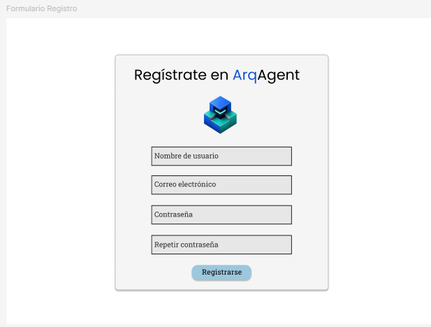
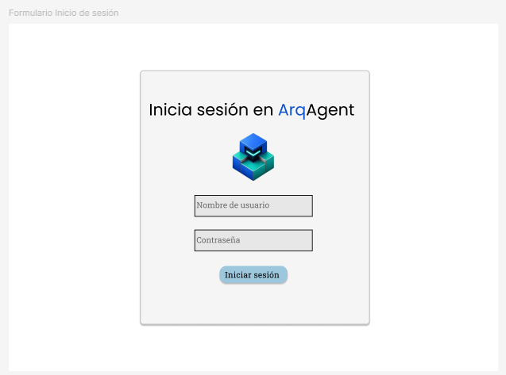
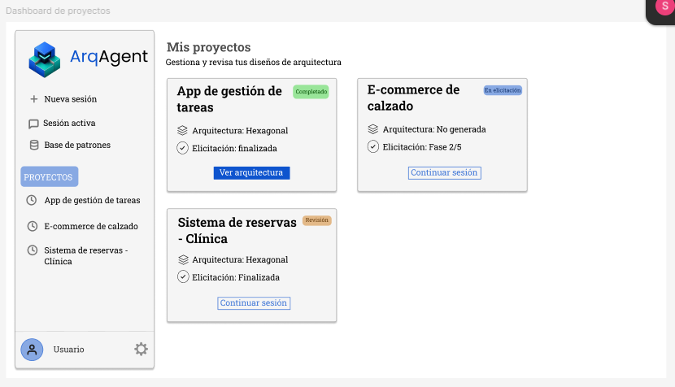
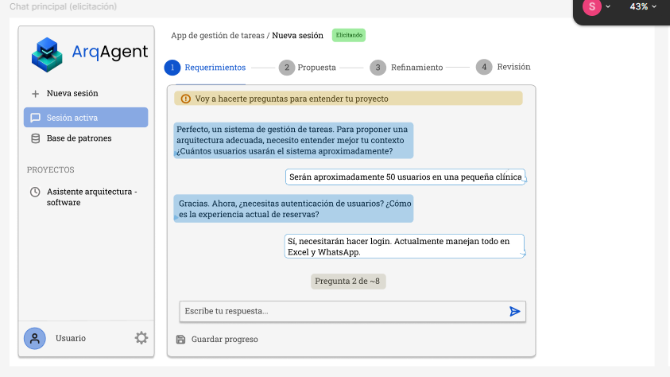
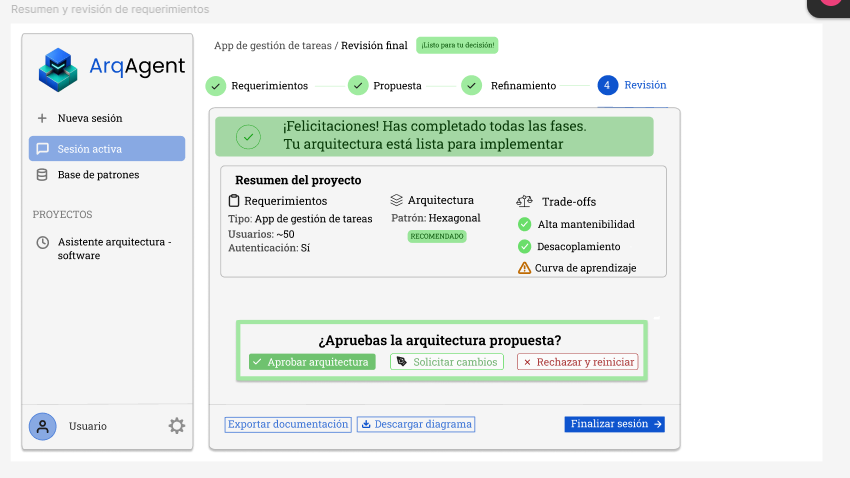
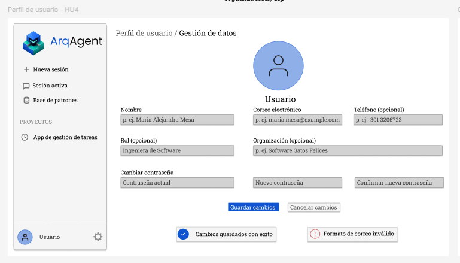
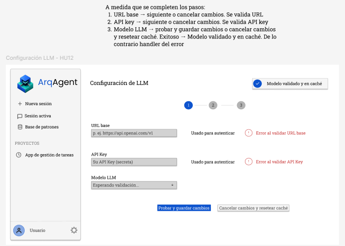
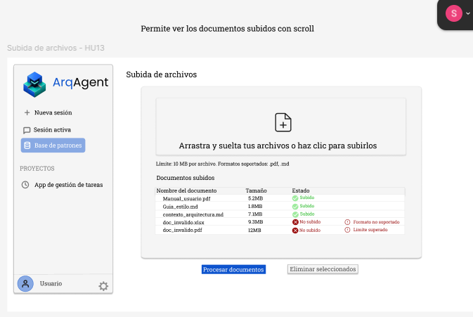

# Mockups UI Arch Agent 🤖
Mockups del UI de Arch Agent (React 18 + Vite 6 + TypeScript SPA, servido por nginx en `:5173`).

Estos mockups sirvieron de referencia para el diseño de la UI actual. La implementación final está en `frontend/src/`.

## Login/Registro — HU1

## Dashboard — Lista de proyectos (HU3)
 

## Chat principal — Flujo de elicitación y propuesta

## Vista de propuesta — Diagrama + Trade-offs + Aprobación

## Perfil de usuario — HU4

## Configuración LLM — HU12

## Subida de archivos — HU13

