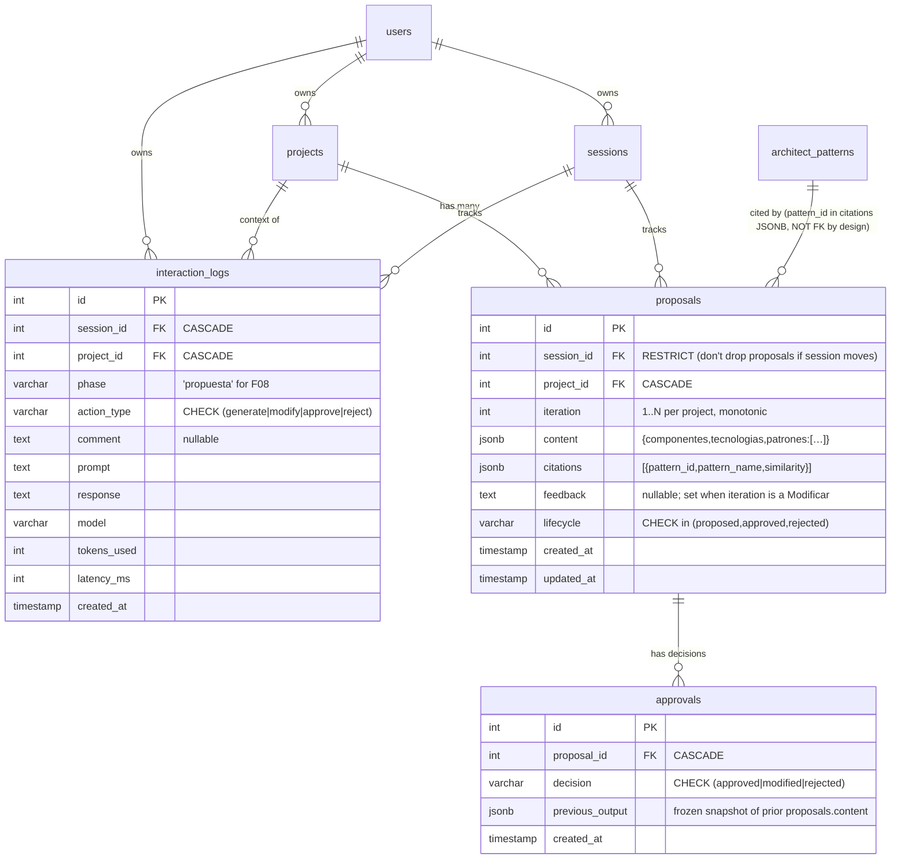

# Design: F08 — Propuesta + Aprobación

| Field | Value |
|---|---|
| Change slug | `F08-propuesta-aprobacion` |
| Capability folder | `openspec/specs/proposal-approval/` |
| Issue | [#12](https://github.com/danielCH26/arch-agent/issues/12) |
| Branch | `feature/F08-propuesta-aprobacion` (HEAD `7a3b2b1`) |
| Base | `origin/feature/Pipeline_RAG_PGVector` HEAD `c75b73c` (PR #64 OPEN) |
| Approach (locked) | **A** — relational `proposals` + `interaction_logs` + `approvals`, inline SSE `ProposalCard` |
| Relationship to upstream artifacts | Translates `proposal.md` (`f467154`) + `spec.md` (`7a3b2b1`) into testable boundaries. Locks 7 ambiguities resolved upstream. |
| Engram topic_key for THIS artifact | `sdd/F08-propuesta-aprobacion/design` (type=`architecture`, `capture_prompt=false`) |
| Size budget | `review_budget_lines=800` → split into chained PRs (deferred to `sdd-tasks`) |

## 1. Architecture overview

F08 adds a fourth domain (`proposal-approval`) to the arch-agent monorepo that reuses PR #64's RAG pipeline and SSE transport verbatim. The backend mounts a new FastAPI router (`app/api/proposals.py`) that emits the **same** SSE event surface as `app/api/chat.py` (`sources | token | done | error`) and persists every generation/iteration/approval to three new relational tables (`migrations/0008_proposals_and_logs.sql`). The frontend mounts a `ProposalCard` component under `ChatWindow` only when `current_phase === "propuesta"`, with a `ProposalActions` panel backed by a Zustand store (`proposalsStore.ts`). Source of truth is PostgreSQL — Engram is best-effort and outage MUST NOT block writes (REQ-9 / SCN-10).

```
                              ┌──────────────────────────────────────┐
                              │             Frontend (React 18)      │
                              │  ChatWindow                          │
                              │   ├ MessageBubble (chat msgs)        │
                              │   └ ProposalCard  (only in propuesta)│
                              │       ├ CitationList                 │
                              │       └ ProposalActions              │
                              │            (Aprobar/Modificar/       │
                              │             Rechazar)                │
                              │  Zustand: chatStore + proposalsStore │
                              └────────────────┬─────────────────────┘
                                               │ SSE (sources|token|done|error)
                                               │ POST /api/proposals/{generate,modify,decide,get}
                              ┌────────────────┴─────────────────────┐
                              │     Backend (FastAPI, app/api)        │
                              │  proposals.py (NEW)  ─►  chat.py SSE  │
                              │   │                                  │
                              │   ├ ProposalGenerator (core/NEW)      │
                              │   │   └► rag.py::similarity_search    │
                              │   │       (scope="patterns", k=5)    │
                              │   │   └► llm_loader.py::build_…       │
                              │   │       (PR #64 contract)          │
                              │   │   └► engram_client (best-effort)  │
                              │   └ models/{proposal,                │
                              │           interaction_log,approval}.py│
                              └────────────────┬─────────────────────┘
                                               │ SQLAlchemy 2.0
                              ┌────────────────┴─────────────────────┐
                              │      PostgreSQL 16 + PGVector        │
                              │  proposals  interaction_logs         │
                              │  approvals   architect_patterns      │
                              │  (migration 0008 = idempotent IF    │
                              │   NOT EXISTS; runner sees 0008)      │
                              └──────────────────────────────────────┘
```

## 2. Component inventory

All paths absolute under `C:\Users\danie\Downloads\arch-agent`. LOC budget reflects work-unit commits per `work-unit-commits`. Sum ≤ `review_budget_lines=800`.

| File | Action | Responsibility | Key imports | LOC est |
|---|---|---|---|---|
| `migrations\0008_proposals_and_logs.sql` | NEW (idempotent) | CREATE TABLE IF NOT EXISTS × 3 + CREATE INDEX IF NOT EXISTS × 5 | n/a | 60 |
| `app\models\proposal.py` | NEW | `Proposal` ORM, lifecycle CHECK | `Base`, `JSONB`, `ForeignKey` | 35 |
| `app\models\interaction_log.py` | NEW | `InteractionLog` ORM (phase, action_type, comment, prompt, response, model, tokens, latency) | `Base`, `JSONB`, `ForeignKey` | 40 |
| `app\models\approval.py` | NEW | `Approval` ORM (decision CHECK, previous_output JSONB) | `Base`, `JSONB`, `ForeignKey` | 30 |
| `app\models\__init__.py` | MODIFY | Register 3 new models | — | 5 |
| `app\core\proposal_generator.py` | NEW | `ProposalGenerator` class: `generate()`, `regenerate_with_feedback()`, `stream() → AsyncIterator[str]`; threshold-aware RAG wrapper; structured prompt; citation extraction | `similarity_search`, `build_langchain_model`, `RAG_MIN_SIMILARITY` (re-import from `app.api.chat`), `langchain_core` | 170 |
| `app\api\proposals.py` | NEW | `router` w/ 4 endpoints (`generate` SSE, `modify` SSE, `decide` JSON, `get_by_id` JSON); reuses `SSEStreamCallbackHandler` and `X-Accel-Buffering: no` headers from `app.api.chat`/`app.api.sse` | `StreamingResponse`, `BaseModel`, `get_current_user`, `ProposalGenerator` | 200 |
| `frontend\src\api\proposals.ts` | NEW | Typed REST client (`generateProposal`, `modifyProposal`, `decideProposal`, `getProposal`) + SSE parser mirroring `frontend/src/api/chat.ts` (same `sources | token | done | error` contract) | `authStore`, `apiFetch`, `fetch` | 90 |
| `frontend\src\stores\proposalsStore.ts` | NEW | Zustand state: `currentProposal`, `iterations[]`, `inFlight`, `error`; actions: `generate`, `modify`, `decide` | `zustand`, `proposalsApi` | 70 |
| `frontend\src\components\proposals\ProposalCard.tsx` | NEW | Renders streamed markdown + CitationList + ProposalActions; mounts only when `chatStore` reports `current_phase === "propuesta"` (passed via props from ChatWindow) | `MessageBubble` markdown renderer (reuse), `CitationList`, `ProposalActions`, `proposalsStore` | 110 |
| `frontend\src\components\proposals\CitationList.tsx` | NEW | Renders `proposals.citations[*]` (pattern_name + similarity + "ver patrón" link) | — | 35 |
| `frontend\src\components\proposals\ProposalActions.tsx` | NEW | Buttons Aprobar/Modificar/Rechazar + small composer for `feedback` | `proposalsStore` | 70 |
| `frontend\src\components\ChatWindow.tsx` | MODIFY | Mount `<ProposalCard …/>` below `MessageBubble`s when `proposalsStore.currentProposal` is set and phase is `propuesta`; tag proposal message via new `chatStore` flag | `proposalsStore`, `ProposalCard` | +25 |
| `frontend\src\stores\chatStore.ts` | MINOR | Optional `tagProposalMessage(messageId, proposalId)` action | — | +10 |
| `tests\api\test_proposals.py` | NEW | pytest: SCN-1, SCN-2, SCN-3, SCN-4, SCN-5, SCN-7, SCN-8 | — | 110 |
| `tests\api\test_interaction_logs.py` | NEW | pytest: SCN-6 (idempotency), SCN-10 (Engram outage resilience) | — | 50 |
| `tests\core\test_proposal_generator.py` | NEW | pytest: prompt assembly, citation filter, regenerate_with_feedback | — | 60 |
| `frontend\src\components\proposals\__tests__\ProposalCard.test.tsx` | NEW | Vitest: REQ-1/REQ-3 visual contract, SCN-8 mount condition | `@testing-library/react`, `vitest` | 40 |
| `frontend\src\components\proposals\__tests__\ProposalActions.test.tsx` | NEW | Vitest: SCN-4/REQ-3 click dispatch | — | 35 |
| `frontend\src\components\proposals\__tests__\CitationList.test.tsx` | NEW | Vitest: SCN-2/SCN-3 render | — | 25 |
| `docs\adr\008-f08-relational-source-of-truth.md` | NEW | ADR-008 | — | (separate file) |
| `docs\adr\009-sse-pattern-reuse.md` | NEW | ADR-009 | — | (separate file) |

**Total authored LoC**: ≈1 220 (above 800) → split into 2 chained PRs (slice plan in §14).

## 3. Sequence diagrams

### SD-1 — `POST /api/proposals/generate`

```mermaid
sequenceDiagram
    autonumber
    participant U as User (ChatWindow)
    participant F as ProposalCard / proposalsStore
    participant B as /api/proposals (FastAPI)
    participant R as rag.py::similarity_search
    participant DB as PostgreSQL
    participant L as build_langchain_model (LLM)
    participant E as engram_client (best-effort)

    U->>F: click "Generar propuesta"
    F->>B: POST /api/proposals/generate {project_id}
    B->>DB: SELECT projects WHERE id=… AND user_id=… (ownership)
    B->>R: similarity_search(query=summary, scope="patterns", k=5)
    R-->>B: docs[] (metadata.similarity, metadata.pattern_id)
    B->>B: filter docs by RAG_MIN_SIMILARITY (0.85) → citations[]
    B-->>F: SSE event: sources {docs metadata}
    F->>F: CitationList mount
    B->>L: model.astream(structured_prompt_with_citations)
    loop per token
        L-->>B: token chunk
        B-->>F: SSE event: token
        F->>F: append to currentProposal.content
    end
    B->>DB: BEGIN; INSERT proposals (content, citations, lifecycle="proposed", iteration=1); INSERT interaction_logs (phase="propuesta", prompt, response, model, tokens_used, latency_ms); COMMIT
    alt Engram reachable
        B->>E: save_observation (best-effort)
        E-->>B: ack OR EngramError (logged, ignored)
    end
    B-->>F: SSE event: done {proposal_id, citations}
    F->>F: store.currentProposal = full; ProposalActions enabled
    Note over F: any LLM error ⇒ B emits event: error; DB write is NOT performed
```

### SD-2 — `POST /api/proposals/{id}/modify` (iteration loop)

```mermaid
sequenceDiagram
    autonumber
    participant U as User
    participant F as ProposalActions + proposalsStore
    participant B as /api/proposals
    participant DB as PostgreSQL

    U->>F: click "Modificar" + feedback="agregar cache"
    F->>B: POST /api/proposals/{id}/modify {feedback}
    B->>DB: SELECT proposals WHERE id=… AND user_id=… (ownership + lifecycle check)
    B->>DB: INSERT approvals (proposal_id, decision="modified", previous_output=content_json)  -- BEFORE new row
    Note over B,DB: iteration = SELECT MAX(iter) WHERE project_id=… + 1
    B->>DB: SELECT MAX(iteration) WHERE project_id=…
    B->>B: ProposalGenerator.regenerate_with_feedback(prior_content, feedback)
    B->>B: rebuild prompt = prior_content + feedback + fresh RAG
    Note over B: stream is identical to SD-1 (sources|token|done)
    B->>DB: INSERT proposals (iteration+1, feedback, …)
    B->>DB: INSERT interaction_logs (action_type="modify", comment=feedback, …)
    B-->>F: SSE event: done {proposal_id=NEW, citations}
    F->>F: append to iterations[]; show new card
```

### SD-3 — Aprobar / Rechazar (`POST /api/proposals/{id}/decide`)

```mermaid
sequenceDiagram
    autonumber
    participant U as User
    participant F as ProposalActions
    participant B as /api/proposals
    participant DB as PostgreSQL

    U->>F: click "Aprobar"
    F->>B: POST /api/proposals/{id}/decide {decision:"approved", comment?}
    B->>DB: BEGIN
    B->>DB: UPDATE proposals SET lifecycle='approved' WHERE id=… AND user_id=…
    B->>DB: INSERT interaction_logs (action_type='approve', phase='propuesta', comment)
    B->>DB: UPDATE projects SET phase_ready=true WHERE id=… AND user_id=…
    B->>DB: COMMIT
    B-->>F: 200 {lifecycle:"approved", phase_ready:true, current_phase:"propuesta"}
    F->>F: hide ProposalActions; show green chip

    Note over U,B: Rechazar path (alternative end of sequence):
    U->>F: click "Rechazar"
    F->>B: POST /api/proposals/{id}/decide {decision:"rejected", comment?}
    B->>DB: BEGIN
    B->>DB: UPDATE proposals SET lifecycle='rejected'
    B->>DB: INSERT interaction_logs (action_type='reject', phase='propuesta', comment)
    B->>DB: UPDATE projects SET current_phase = PROPOSAL_REJECT_REVERTS_TO (default "requerimientos"), phase_ready=false
    B->>DB: COMMIT
    B-->>F: 200 {lifecycle:"rejected", current_phase:"requerimientos"}
```

### SD-4 — Resilience: Engram down (REQ-9 / SCN-10)

```mermaid
sequenceDiagram
    autonumber
    participant F as proposalsStore
    participant B as /api/proposals
    participant DB as PostgreSQL
    participant E as engram_client

    F->>B: POST /api/proposals/generate
    B->>DB: SELECT projects OK
    B->>B: RAG + LLM stream OK
    B->>DB: INSERT proposals + interaction_logs (COMMIT)
    B->>E: save_observation()
    E--xB: EngramError (ConnectionError on localhost:7439)
    B->>B: logger.warning(…); continue
    B-->>F: SSE event: done {proposal_id, citations}
    Note over F,E: User receives completed proposal; Engram outage NEVER blocks writes
```

## 4. Data model



**Indexes (per spec "Indexes" subsection + uniqueness constraint)**:
- `UNIQUE INDEX idx_proposals_project_iter ON proposals(project_id, iteration)` — enforces one row per `(project, iteration)` slot.
- `INDEX idx_proposals_project_lifecycle ON proposals(project_id, lifecycle)`.
- `INDEX idx_interaction_logs_project_phase_created ON interaction_logs(project_id, phase, created_at DESC)`.
- `INDEX idx_interaction_logs_proposal ON interaction_logs(project_id, phase) WHERE phase='propuesta'` (partial — keeps log small).
- `INDEX idx_approvals_proposal ON approvals(proposal_id, created_at DESC)`.

**FK semantics**:
- `proposals.session_id` → `sessions.id` **RESTRICT** (proposal persists even if user starts a new session).
- `proposals.project_id` → `projects.id` **CASCADE** (deleting a project nukes its proposals).
- `interaction_logs.{session_id, project_id}` → **CASCADE**.
- `approvals.proposal_id` → `proposals.id` **CASCADE**.
- `architect_patterns` is referenced **only by `proposals.citations[*].pattern_id`** (JSONB, no FK constraint — pattern deletion must NOT cascade-delete proposals, they are historical artifacts). A follow-up reviewer task MAY add a JSONB-existence check or app-layer guard; out of scope v1.

## 5. API surface

All routes mounted by `app/api/proposals.py` under `APIRouter(prefix="/api/proposals", tags=["proposals"])`. JWT required on all (`Depends(get_current_user)`). No reuse of any PR #64 HTTP endpoint — the chat SSE contract is a **template** we mirror (see ADR-009).

| Method | Path | Body | Success | Status codes |
|---|---|---|---|---|
| POST | `/api/proposals/generate` | `{project_id: int}` | **200** SSE (`sources \| token \| done`) | 200, 400 (missing project_id), 401, 403 (not owned), 404 (no project), 409 (no LLM config), 500 (LLM init failed) |
| POST | `/api/proposals/{id}/modify` | `{feedback: str}` | **200** SSE (`sources \| token \| done`) — body includes new `proposal_id` | 200, 400, 401, 403, 404, 409 (LLM), 429 (iteration cap, default 5, configurable via `PROPOSAL_MAX_ITER`) |
| POST | `/api/proposals/{id}/decide` | `{decision: "approved"\|"rejected", comment?: str}` | **200** `{proposal_id, lifecycle, current_phase, phase_ready}` | 200, 400 (invalid decision), 401, 403, 404, 409 (already decided — `interaction_logs` has implicit idempotency via `(proposal_id, action_type)`) |
| GET | `/api/proposals/{id}` | — | **200** `ProposalOut` `{id, project_id, iteration, content, citations, feedback?, lifecycle, created_at}` | 200, 401, 403, 404 |

**SSE headers (replicated from `app/api/chat.py`)**:

```
Content-Type: text/event-stream
Cache-Control: no-cache
X-Accel-Buffering: no
```

**SSE event names** (mirrors chat; ADR-009):

| event | data (JSON) | When |
|---|---|---|
| `sources` | `[{pattern_id, pattern_name, similarity}]` | Once, before any `token`. Empty list when RAG returns nothing. |
| `token` | `"<string chunk>"` | Per LLM token (server emits UTF-8, JSON-encoded string) |
| `done` | `{proposal_id: int, citations: [{pattern_id, pattern_name, similarity}]}` | Once, after the new `proposals` row is committed and `interaction_logs` is written |
| `error` | `"<error message string>"` | Once, on LLM/DB failure. DB writes are NOT performed when this fires. |

**Pydantic request models (signatures)**:

```python
class GenerateRequest(BaseModel):
    project_id: int

class ModifyRequest(BaseModel):
    feedback: str = Field(..., min_length=1, max_length=2000)

class DecideRequest(BaseModel):
    decision: Literal["approved", "rejected"]
    comment: Optional[str] = Field(None, max_length=2000)

class ProposalOut(BaseModel):
    id: int
    project_id: int
    iteration: int
    content: dict
    citations: list[dict]
    feedback: Optional[str]
    lifecycle: str
    created_at: str
```

**No PR #64 endpoint is reused by URL**; `app/api/chat.py`'s `POST /api/chat` stays untouched. We replicate its SSE shape in `app/api/proposals.py` per ADR-009.

## 6. Frontend design

**Component tree** (mounted by `ChatWindow` when `phase === "propuesta"`):

```
ChatWindow (existing)
├─ MessageBubble (existing) for chat stream
├─ ProposalCard (NEW, conditional)
│  ├─ markdown body (reuse MessageBubble's `renderMarkdownBlocks` export — or inline a shared helper in `frontend/src/components/proposals/markdown.ts`)
│  ├─ CitationList (NEW)  ── props: citations[], key=pattern_id
│  └─ ProposalActions (NEW) ── props: proposalId, onApprove, onModify, onReject, status
└─ ChatInput (existing)
```

**Zustand `proposalsStore` state shape**:

```ts
interface ProposalCitation { pattern_id: number; pattern_name: string; similarity: number }
interface Proposal {
  id: number
  project_id: number
  iteration: number
  content_markdown: string   // streamed
  content_json?: Record<string, unknown> // populated from done.citations + parsed markdown
  citations: ProposalCitation[]
  lifecycle: 'proposed' | 'approved' | 'rejected'
  feedback?: string | null
  created_at: string
}
interface ProposalsState {
  currentProposal: Proposal | null
  iterations: Proposal[]                    // history for this project
  inFlight: 'idle' | 'generating' | 'modifying' | 'deciding'
  error: string | null
  generate: (projectId: number) => Promise<void>
  modify:   (proposalId: number, feedback: string) => Promise<void>
  decide:   (proposalId: number, decision: 'approved' | 'rejected', comment?: string) => Promise<void>
  reset:    () => void
}
```

**SSE → store hydration**: `generate()` opens a `fetch` SSE stream; on `event: sources` the store sets `currentProposal.citations`; on `event: token` appends to `currentProposal.content_markdown`; on `event: done` the store sets `currentProposal.id`, prepends to `iterations[]`, sets `inFlight='idle'`; on `event: error` sets `error`.

**Mount condition**: `ChatWindow.tsx` reads `phase` from `projectsStore.currentProject.current_phase` and renders `<ProposalCard …/>` ONLY when `phase === "propuesta"` (REQ-7 / SCN-8).

## 7. Backend module design (signatures only — no bodies)

```python
# app/models/proposal.py
class Proposal(Base):
    __tablename__ = "proposals"
    id = Column(Integer, primary_key=True)
    session_id = Column(Integer, ForeignKey("sessions.id", ondelete="RESTRICT"), nullable=True)
    project_id = Column(Integer, ForeignKey("projects.id", ondelete="CASCADE"), nullable=False)
    iteration = Column(Integer, nullable=False)
    content = Column(JSONB, nullable=False)         # {componentes, tecnologias, patrones:[…]}
    citations = Column(JSONB, nullable=False, default=list)
    feedback = Column(Text, nullable=True)
    lifecycle = Column(String(16), nullable=False, default="proposed",
                       server_default="proposed")
    created_at = Column(TIMESTAMP, server_default=func.now())
    updated_at = Column(TIMESTAMP, server_default=func.now())
    __table_args__ = (
        UniqueConstraint("project_id", "iteration", name="idx_proposals_project_iter"),
        CheckConstraint(
            "lifecycle IN ('proposed','approved','rejected')",
            name="chk_proposals_lifecycle",
        ),
    )

# app/models/interaction_log.py
class InteractionLog(Base):
    __tablename__ = "interaction_logs"
    id = Column(Integer, primary_key=True)
    session_id = Column(Integer, ForeignKey("sessions.id", ondelete="CASCADE"), nullable=True)
    project_id = Column(Integer, ForeignKey("projects.id", ondelete="CASCADE"), nullable=False)
    phase = Column(String(50), nullable=False)         # 'propuesta'
    action_type = Column(String(20), nullable=False)    # generate|modify|approve|reject
    comment = Column(Text, nullable=True)
    prompt = Column(Text, nullable=True)
    response = Column(Text, nullable=True)
    model = Column(String(100), nullable=True)
    tokens_used = Column(Integer, nullable=True)
    latency_ms = Column(Integer, nullable=True)
    created_at = Column(TIMESTAMP, server_default=func.now())

# app/models/approval.py
class Approval(Base):
    __tablename__ = "approvals"
    id = Column(Integer, primary_key=True)
    proposal_id = Column(Integer, ForeignKey("proposals.id", ondelete="CASCADE"), nullable=False)
    decision = Column(String(16), nullable=False)  # approved|modified|rejected
    previous_output = Column(JSONB, nullable=True)
    created_at = Column(TIMESTAMP, server_default=func.now())
    __table_args__ = (
        CheckConstraint(
            "decision IN ('approved','modified','rejected')",
            name="chk_approvals_decision",
        ),
    )

# app/core/proposal_generator.py
class ProposalGenerator:
    def __init__(self, user_id: int, project_id: int): ...
    def _summary_query(self) -> str: ...
    def _retrieve_patterns(self, query: str) -> tuple[list[Document], list[dict]]: ...
    def _build_prompt(self, citations: list[dict], prior: str | None, feedback: str | None) -> str: ...
    async def stream(self) -> AsyncIterator[StreamEvent]: ...
    async def generate(self) -> tuple[int, list[dict]]: ...                # synchronous helper for tests
    async def regenerate_with_feedback(self, prior_proposal_id: int, feedback: str) -> tuple[int, list[dict]]: ...

# app/api/proposals.py
router = APIRouter(prefix="/api/proposals", tags=["proposals"])
PROPOSAL_REJECT_REVERTS_TO = os.getenv("PROPOSAL_REJECT_REVERTS_TO", "requerimientos")
PROPOSAL_MAX_ITER = int(os.getenv("PROPOSAL_MAX_ITER", "5"))
RAG_MIN_SIMILARITY = 0.85  # re-imported conceptually from app.api.chat (single source)

@router.post("/generate")
async def generate_proposal(body: GenerateRequest, current_user=Depends(get_current_user)): ...   # SSE

@router.post("/{proposal_id}/modify")
async def modify_proposal(proposal_id: int, body: ModifyRequest, current_user=Depends(get_current_user)): ...  # SSE

@router.post("/{proposal_id}/decide")
async def decide_proposal(proposal_id: int, body: DecideRequest, current_user=Depends(get_current_user)): ...  # JSON

@router.get("/{proposal_id}", response_model=ProposalOut)
async def get_proposal(proposal_id: int, current_user=Depends(get_current_user)): ...

def _emit_sse(event: str, data: str | dict) -> str: ...     # mirrors app/api/chat.py emit pattern
```

**Notable behaviour**: `_emit_sse` is a small helper that produces `f"event: {name}\ndata: {json.dumps(data, ensure_ascii=False)}\n\n"` — the same shape `chat.py` inlines. The same `SSEStreamCallbackHandler` (from `app/api/sse.py`) is used so the LLM token hand-off is identical to chat.

## 8. SSE event contract (reference)

| Event | Payload (JSON) | Frontend action |
|---|---|---|
| `sources` | `[{pattern_id, pattern_name, similarity}]` | `proposalsStore.setSources(s)` → `CitationList` |
| `token` | `"<chunk string>"` | append to `currentProposal.content_markdown`; re-render ProposalCard |
| `done` | `{proposal_id: int, citations: [...]}` | `proposalsStore.setCurrentProposal({...})` + push into `iterations`; enable ProposalActions |
| `error` | `"<msg string>"` | `proposalsStore.setError(msg)` |

**Headers**: `Content-Type: text/event-stream`, `Cache-Control: no-cache`, `X-Accel-Buffering: no` (reused verbatim from `app/api/chat.py`). Any divergence from the chat SSE surface MUST be justified in code review — ADR-009.

## 9. Migration strategy

File: `C:\Users\danie\Downloads\arch-agent\migrations\0008_proposals_and_logs.sql`. **Not applied by this phase** — apply phase owns the DDL. Idempotent (`CREATE TABLE IF NOT EXISTS`, `CREATE INDEX IF NOT EXISTS`, `DO $$ … EXCEPTION WHEN duplicate_object THEN NULL $$` for constraints, or rely on `IF NOT EXISTS` + inline `CHECK`). Number is `0008` to avoid collision with PR #64's `0007_add_document_chunks_indexes.sql`.

```sql
-- proposals
CREATE TABLE IF NOT EXISTS proposals (
    id SERIAL PRIMARY KEY,
    session_id INTEGER REFERENCES sessions(id) ON DELETE RESTRICT,
    project_id INTEGER NOT NULL REFERENCES projects(id) ON DELETE CASCADE,
    iteration INTEGER NOT NULL,
    content JSONB NOT NULL,
    citations JSONB NOT NULL DEFAULT '[]'::jsonb,
    feedback TEXT,
    lifecycle VARCHAR(16) NOT NULL DEFAULT 'proposed',
    created_at TIMESTAMP DEFAULT CURRENT_TIMESTAMP,
    updated_at TIMESTAMP DEFAULT CURRENT_TIMESTAMP,
    CONSTRAINT idx_proposals_project_iter UNIQUE (project_id, iteration),
    CONSTRAINT chk_proposals_lifecycle CHECK (lifecycle IN ('proposed','approved','rejected'))
);
CREATE INDEX IF NOT EXISTS idx_proposals_project_lifecycle
    ON proposals (project_id, lifecycle);

-- interaction_logs
CREATE TABLE IF NOT EXISTS interaction_logs (
    id SERIAL PRIMARY KEY,
    session_id INTEGER REFERENCES sessions(id) ON DELETE CASCADE,
    project_id INTEGER NOT NULL REFERENCES projects(id) ON DELETE CASCADE,
    phase VARCHAR(50) NOT NULL,
    action_type VARCHAR(20) NOT NULL,
    comment TEXT,
    prompt TEXT,
    response TEXT,
    model VARCHAR(100),
    tokens_used INTEGER,
    latency_ms INTEGER,
    created_at TIMESTAMP DEFAULT CURRENT_TIMESTAMP,
    CONSTRAINT chk_interaction_logs_action CHECK (action_type IN ('generate','modify','approve','reject'))
);
CREATE INDEX IF NOT EXISTS idx_interaction_logs_project_phase_created
    ON interaction_logs (project_id, phase, created_at DESC);
CREATE INDEX IF NOT EXISTS idx_interaction_logs_propuesta
    ON interaction_logs (project_id, created_at DESC) WHERE phase = 'propuesta';

-- approvals
CREATE TABLE IF NOT EXISTS approvals (
    id SERIAL PRIMARY KEY,
    proposal_id INTEGER NOT NULL REFERENCES proposals(id) ON DELETE CASCADE,
    decision VARCHAR(16) NOT NULL,
    previous_output JSONB,
    created_at TIMESTAMP DEFAULT CURRENT_TIMESTAMP,
    CONSTRAINT chk_approvals_decision CHECK (decision IN ('approved','modified','rejected'))
);
CREATE INDEX IF NOT EXISTS idx_approvals_proposal
    ON approvals (proposal_id, created_at DESC);
```

Rollback: `DROP TABLE IF EXISTS approvals, interaction_logs, proposals CASCADE;` (per proposal §10). All FKs collapse cleanly via `CASCADE`. Idempotent rerun safe because of `IF NOT EXISTS`.

## 10. Error handling and resilience

| Scenario | Response | Tested by |
|---|---|---|
| LLM timeout (LangChain `asyncio.TimeoutError`) | SSE `event: error`, DB rows NOT written, status stays `proposed` only if a prior row exists | SCN-11 (Vitest + pytest) |
| RAG `similarity_search(scope="patterns")` returns `[]` | SSE `event: sources` data `[]`; LLM drafts without citations; `proposals.citations=[]`, `lifecycle="proposed"` still allowed; UI shows "Sin contexto recuperado" | SCN-3 (negative) |
| `RAG_MIN_SIMILARITY` filters all candidates | Same as above; `citations=[]` | SCN-3 |
| Engram unreachable (`ConnectionError` on `localhost:7439`) | SSE `done` still fires; DB rows persisted; `logger.warning("Engram mirror failed: …")`; never raise to caller | **SCN-10** |
| Migration 0008 already applied (re-run) | `CREATE TABLE IF NOT EXISTS` skips silently; `run_migrations.py` short-circuits per filename | **SCN-6** |
| Duplicate iteration key (`UNIQUE (project_id, iteration)` violation) | 409 with `detail="Otra generación de propuesta está en curso para este proyecto"`; client retries after refresh | implicit |
| Race on Aprobar (two tabs click at once) | `interaction_logs` inserts are idempotent at the DB level (`INSERT … ON CONFLICT` not used in v1); the second client sees 409 with `lifecycle="approved"` already; UI re-syncs via `GET /api/proposals/{id}` | SCN-4 + a manual smoke test |
| Iteration cap (`PROPOSAL_MAX_ITER=5`) hit | 409 with `detail="Has alcanzado el máximo de iteraciones (5)"` | manual smoke |
| Ownership mismatch (user A reads user B's proposal) | 403 | SCN-8 path |
| Unknown `decision` value (e.g. `"banana"`) | 422 from Pydantic (covered by `Literal[...]`) | unit test |
| LLM emits no tokens and crashes before first byte | SSE `event: error`; no proposal row written; UI shows banner | SCN-11 |

## 11. ADRs to add

| ADR | File | Title | Status | Why |
|---|---|---|---|---|
| **008** | `C:\Users\danie\Downloads\arch-agent\docs\adr\008-f08-relational-source-of-truth.md` | F08 — Relational source of truth for proposals | **accepted** | Mandates new `proposals` + `interaction_logs` + `approvals` tables. Rejects JSONB-only Approach B because the issue's acceptance criterion names the `interaction_logs` table explicitly. Keeps Engram best-effort mirror. |
| **009** | `C:\Users\danie\Downloads\arch-agent\docs\adr\009-sse-pattern-reuse.md` | SSE streaming pattern reuse from `app/api/chat.py` | **accepted** | Locks the SSE event surface (`sources \| token \| done \| error`), `X-Accel-Buffering: no` header, and `SSEStreamCallbackHandler` as the canonical pattern for any new SSE endpoint. Avoids divergence. |

Both ADR files are written as separate artifacts (full body in `docs/adr/008-…md` and `docs/adr/009-…md`) — this design.md only summarizes them.

## 12. PR #64 dependency map

All pinned imports (read-only) from PR #64 HEAD `c75b73c`:

| Symbol | Path | Used by |
|---|---|---|
| `similarity_search(scope="patterns", k=5)` | `C:\Users\danie\Downloads\arch-agent\app\core\rag.py` | `ProposalGenerator._retrieve_patterns` |
| `ArchitectPattern` (table `architect_patterns`) | `C:\Users\danie\Downloads\arch-agent\app\models\architect_pattern.py` | `proposals.citations` JSONB target |
| `RAG_MIN_SIMILARITY = 0.85` constant | `C:\Users\danie\Downloads\arch-agent\app\api\chat.py:39` (re-declared in `app/api/proposals.py` to avoid circular import) | citation threshold |
| `SSEStreamCallbackHandler` | `C:\Users\danie\Downloads\arch-agent\app\api\sse.py` | `app/api/proposals.py` LLM stream |
| `build_langchain_model(user_id)` | `C:\Users\danie\Downloads\arch-agent\app\core\llm_loader.py` | `ProposalGenerator.stream` (LangChain model) |
| `scripts/seed_patterns.py` (11 patterns) | PR #64 | test fixtures (deterministic `pattern_id`s) |

**Rebase gate**: rebased ONLY after PR #64 merges to `development`. Until then, base stays `c75b73c`. **Warn the orchestrator**: if any symbol above changes before PR #64 merges, status → `blocked` and re-open this design. A reviewer MAY propose renaming `_pattern_to_document` or moving `RAG_MIN_SIMILARITY`; both are detectable here.

## 13. Chained-PR readiness

Slice plan from `proposal.md` §11 (reaffirmed — final decision deferred to `sdd-tasks`):

| Slice | Scope | LoC budget | Function/class boundary that makes the split clean |
|---|---|---|---|
| **PR #1 — backend core** | `migrations/0008_*` + `app/models/{proposal,interaction_log,approval}.py` + `app/core/proposal_generator.py` (with `_emit_sse` helper stubbed out) + ADR-008 + ADR-009 + `tests/api/test_proposals.py` + `tests/api/test_interaction_logs.py` + `tests/core/test_proposal_generator.py` | ~450 | `ProposalGenerator.stream()` is declared but raises `NotImplementedError("streaming wired in slice 2")`; `app/api/proposals.py` is NOT created in slice 1. |
| **PR #2 — SSE + frontend** | `app/api/proposals.py` (full router + `_emit_sse` filled) + `frontend/src/{api,stores}/proposals*` + `frontend/src/components/proposals/*` + `ChatWindow.tsx` mount + Vitest | ~300–350 | The stub in slice 1 is the seam: PR #2 only edits `app/api/proposals.py` and the frontend. |

Each slice independently testable; PR #2 rebases onto `development` AFTER PR #64 merges AND after PR #1 lands. Chain strategy finalised by `sdd-tasks` forecast.

## 14. Test strategy

Per spec REQ/SCN, with explicit mapping. `strict_tdd=false` → tests required but no RED-GREEN-REFACTOR; tests follow work-unit commits per `work-unit-commits`.

| REQ / SCN | Backend test | Frontend test |
|---|---|---|
| REQ-1 / SCN-1 (3 sections in markdown + JSON round-trip) | `tests/api/test_proposals.py::test_generate_emits_three_sections` | `frontend/.../proposals/__tests__/ProposalCard.test.tsx::renders_three_sections` |
| REQ-2 / SCN-2 (positive cite) | `tests/core/test_proposal_generator.py::test_citation_filter_passes_above_threshold` | `frontend/.../proposals/__tests__/CitationList.test.tsx::renders_citation_with_similarity` |
| REQ-2 / SCN-3 (negative filter) | `tests/core/test_proposal_generator.py::test_citation_filter_drops_below_threshold` | `frontend/.../proposals/__tests__/CitationList.test.tsx::omits_pattern_below_threshold` |
| REQ-3 / SCN-4 (approve → interaction_logs row + lifecycle + phase_ready) | `tests/api/test_proposals.py::test_approve_inserts_interaction_log_and_advances` | `frontend/.../proposals/__tests__/ProposalActions.test.tsx::click_approve_dispatches_decide` |
| REQ-4 / SCN-5 (modify → new iteration + previous_output) | `tests/api/test_proposals.py::test_modify_increments_iteration_and_freezes_previous` | `frontend/.../proposals/__tests__/ProposalActions.test.tsx::click_modify_opens_composer` |
| REQ-5 / SCN-6 (migration idempotency) | `tests/api/test_interaction_logs.py::test_migration_0008_idempotent` | n/a |
| REQ-6 / SCN-7 (SSE done payload) | `tests/api/test_proposals.py::test_generate_sse_done_includes_proposal_id` | n/a |
| REQ-7 / SCN-8 (mount condition) | n/a | `frontend/.../proposals/__tests__/ProposalCard.test.tsx::does_not_render_outside_propuesta_phase` |
| REQ-8 / SCN-9 (env override for reject target) | `tests/api/test_proposals.py::test_reject_uses_PROPOSAL_REJECT_REVERTS_TO_env` | n/a |
| REQ-9 / SCN-10 (Engram outage resilience) | `tests/api/test_proposals.py::test_generate_persists_when_engram_unreachable` | n/a |
| REQ-10 / SCN-11 (suite passes) | `pytest tests/api/test_proposals.py tests/api/test_interaction_logs.py tests/core/test_proposal_generator.py` | `cd frontend && npm run test:run` |

## 15. Out of scope (restated)

- JSONB-only Approach B (rejected: violates literal `interaction_logs` table AC).
- Separate `/propuesta` page or `ProposalEditor` modal (Approach C; revisit post-land).
- Engram-as-MCP mirror of proposal state (Engram stays best-effort).
- Cleanup of `app/models/pattern.py` duplicate (PR #64's domain).
- Reverse-proxy WebSocket transport (we use SSE; ADR-009).
- i18n: UI copy stays Spanish per `MessageBubble`/`PhaseBadge` convention.

## 16. Threat matrix

N/A — F08 does NOT change routing rules, shell commands, subprocess invocation, VCS/PR automation, executable-file classification, or process integration. The only network-adjacent surface is the SSE wire protocol, which is fully documented in §5/§8 and covered by SCN-7. No new external command invocations; `build_langchain_model` and `similarity_search` are read-only and inherited unchanged from PR #64.

## 17. Risks (carried from proposal + new)

1. **PR #64 unmerged — symbol surface changes** (High). Mitigation: rebase gate, ADR-008/009 pin the import list (§12).
2. **800-line review budget boundary** (Med). Mitigation: chained PRs per §13; work-unit commits per `work-unit-commits`.
3. **Migration 0008 ownership collision** (Med). Mitigation: `IF NOT EXISTS`, ADR-008 records F08 ownership.
4. **`docs/database/schema.sql` drift** (Med). F08 mirrors LIVE schema (user-owned `sessions`); ignores legacy doc.
5. **"Rechazar" semantics mismatch with product** (Med). Mitigation: `PROPOSAL_REJECT_REVERTS_TO` env override (REQ-8 / SCN-9), default `"requerimientos"`.
6. **LLM token cost on iteration loops** (Med). Mitigation: `PROPOSAL_MAX_ITER=5` cap; iteration count surfaced in `ProposalActions` UI.
7. **SSE proxy buffering** (Low). Mitigation: reuse `X-Accel-Buffering: no` from `app/api/chat.py` (ADR-009).
8. **Engram unavailable** (Low). Mitigation: best-effort mirror, never blocks DB writes (REQ-9 / SCN-10).
9. **Pydantic v1/v2 schema drift** (NEW, Low). `app/api/chat.py` uses `model.astream()` LangChain object; `app/api/proposals.py` must import the same. If `langchain_core` major bumps, `astream` return type changes. Mitigation: pin `langchain_core~=0.3` in `requirements.txt` (verify in apply).
10. **Zustand 5.x `create<T>()(…)` signature** (NEW, Low). `chatStore.ts` and `authStore.ts` already use the typed form; replicate exactly in `proposalsStore.ts`. If signature changes in Zustand 6, three stores break. Mitigation: stay on Zustand 5.x until coordinated upgrade.
11. **JSONB FK gap for `pattern_id` in citations** (NEW, Low). `architect_patterns` rows deleted AFTER a proposal cites them leave dangling references. Mitigation: render-side "patrón no disponible" fallback; document in ADR-008.
12. **`.gitignore` silently ignores `docs/adr/008-*.md` and `docs/adr/009-*.md`** (NEW, **High**). Confirmed via `git check-ignore -v`: line 38 `*.md` in `.gitignore` (touched by commit `1159c46` which dropped the prior `!docs/**/*.md` exception) blocks new ADRs from being tracked. Existing ADRs 001-007 are tracked because they were `git add`-ed BEFORE the rule tightened. The apply phase MUST add `!docs/adr/**/*.md` (or equivalent) to `.gitignore` BEFORE staging the new ADRs, otherwise `git add docs/adr/008-…md docs/adr/009-…md` will fail silently. Mitigation: pre-flight `git check-ignore docs/adr/008-f08-relational-source-of-truth.md docs/adr/009-sse-pattern-reuse.md` MUST return empty in the apply phase; otherwise fix `.gitignore` first.

## 18. References

- `C:\Users\danie\Downloads\arch-agent\openspec\changes\F08-propuesta-aprobacion\explore.md` @ `2f1c477`
- `C:\Users\danie\Downloads\arch-agent\openspec\changes\F08-propuesta-aprobacion\proposal.md` @ `f467154`
- `C:\Users\danie\Downloads\arch-agent\openspec\specs\proposal-approval\spec.md` @ `7a3b2b1`
- Issue [#12](https://github.com/danielCH26/arch-agent/issues/12)
- PR #64 base `c75b73c` on `origin/feature/Pipeline_RAG_PGVector`
- `C:\Users\danie\Downloads\arch-agent\openspec\config.yaml` (`rules.design`: sequence diagrams + ADR under `docs/adr/`)
- `docs/adr/001-langchain-framework.md`, `docs/adr/002-postgres-pgvector.md`, `docs/adr/004-langfuse.md`, `docs/adr/005-engram-mcp.md`, `docs/adr/006-chainlit-ui.md`, `docs/adr/007-six-mcps.md`
- Reused surfaces: `C:\Users\danie\Downloads\arch-agent\app\api\chat.py` (SSE template), `C:\Users\danie\Downloads\arch-agent\app\api\sse.py` (`SSEStreamCallbackHandler`), `C:\Users\danie\Downloads\arch-agent\app\core\rag.py` (`similarity_search`), `C:\Users\danie\Downloads\arch-agent\app\models\architect_pattern.py` (`ArchitectPattern`).