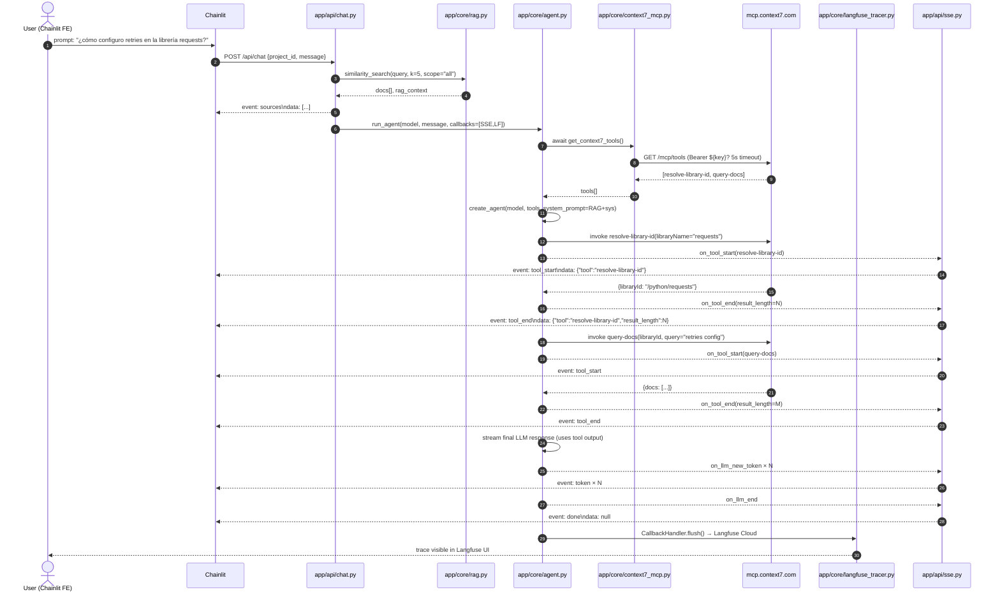
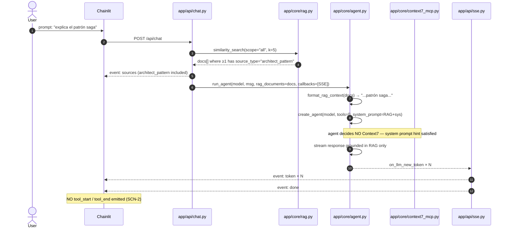
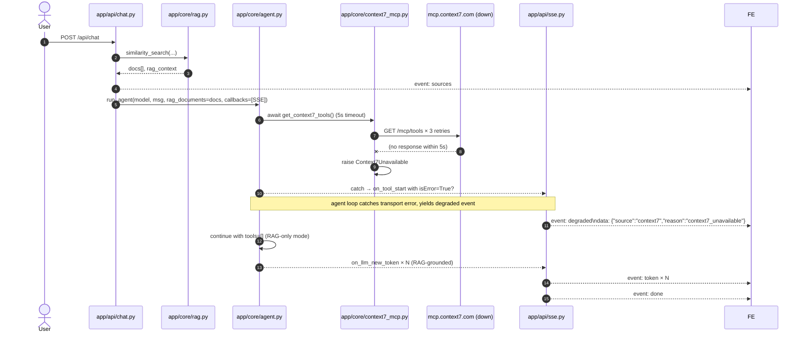

# Design: F11 — Context7 MCP Integration

| Field | Value |
|---|---|
| Capability | `context7-mcp-integration` (NEW; consolidates `agent-runtime` + `langfuse-tracing` per proposal §8) |
| Branch | `feature/F11-context7-mcp` |
| Base SHA | `d139c9e` (`origin/development`, post-merge of PR #64). HEAD working tree = `223f7b4` (F11 spec, 2 commits ahead of `origin/development`). Working tree clean. |
| Proposal | `openspec/changes/F11-context7-mcp/proposal.md` @ `3526122` |
| Spec | `openspec/specs/context7-mcp-integration/spec.md` @ `223f7b4` |
| ADR | `docs/adr/010-context7-agent-runtime.md` @ `3526122` (already in tree) |
| Engram topic_key | `sdd/F11-context7-mcp/design` |
| Phase | `sdd-design` |
| Artifact store | hybrid (OpenSpec file + Engram upsert) |

This design translates the spec (10 REQs, 8 SCNs) into a testable blueprint: which files to create, which to modify, exact function signatures, error paths, SSE event surface, and the per-slice seam plan that lets the 4 chained-PRs in `proposal.md §12` land independently against base `d139c9e`.

---

## 1. Architecture overview

F11 introduces a LangChain `create_agent` runtime between the existing chat route and the user's per-user LLM, and threads Langfuse observability through the SSE pipeline. The frontend (Chainlit) is untouched; only `app/api/chat.py` and `app/api/sse.py` change. Public HTTPS to `https://mcp.context7.com/mcp` is the only new outbound dependency — no Docker service change. RAG retrieval (`app/core/rag.py::similarity_search`) is preserved verbatim and injected into the agent's system prompt by `format_rag_context`.

```
    Chainlit FE (unchanged)                Chainlit FE (unchanged)
            │                                      │
            │  POST /api/chat                       │
            ▼                                      ▼
 ┌──────────────────────────────────────────────────────────────┐
 │  app/api/chat.py  (MODIFIED — line 60-197 at d139c9e)        │
 │   • validate project ownership (unchanged)                   │
 │   • build model via build_langchain_model(user_id)           │
 │   • retrieve RAG via similarity_search(...)                  │
 │   • yield sources event first (F08 schema, unchanged)        │
 │   • swap model.astream(prompt) → agent.astream_events(...)   │
 └────────┬──────────────────────────────────────┬──────────────┘
          │ SSE: sources                        │ SSE: tool_start / tool_end / token / done
          ▼                                     ▼
   ┌────────────────────┐                ┌────────────────────────┐
   │ app/core/rag.py    │                │ app/api/sse.py (MOD)   │
   │ (UNCHANGED)        │                │  SSEStreamCallbackH..  │
   │  PGVector + 384d   │                │   + on_tool_start/end │
   └────────────────────┘                └──────────┬─────────────┘
                                                    │ callbacks=[SSE, langfuse?]
                                                    ▼
                              ┌─────────────────────────────────────┐
                              │ app/core/agent.py  (NEW)             │
                              │  build_agent(model, sys, tools)     │
                              │  format_rag_context(docs) → str     │
                              │  run_agent(model, msg, *, cfgs)     │
                              └─────┬───────────────────┬───────────┘
                                    │                   │
                       tools=await │                   │ callbacks=CallbackHandler()|None
                                    ▼                   ▼
                  ┌────────────────────────┐   ┌────────────────────────────┐
                  │ app/core/context7_mcp  │   │ app/core/langfuse_tracer   │
                  │  MultiServerMCPClient  │   │  CallbackHandler() | None  │
                  │  transport: http       │   │  WARNING when env unset    │
                  │  url: mcp.context7.com │   └─────────────┬──────────────┘
                  │  header: Bearer ${key} │                 │
                  └────────────┬───────────┘                 ▼
                               │ HTTPS (5s timeout)  ┌────────────────────┐
                               ▼                     │ Langfuse Cloud     │
                   ┌───────────────────────┐         │ localhost:3000     │
                   │ mcp.context7.com/mcp  │         │ (Docker compose)   │
                   │  resolve-library-id   │         └────────────────────┘
                   │  query-docs           │
                   └───────────────────────┘
```

---

## 2. Component inventory

All NEW + MODIFIED files inside the repo with absolute paths, purpose, key imports, and LoC budget.

| Path (absolute inside repo) | Action | Purpose | Key imports | LoC est. |
|---|---|---|---|---|
| `C:\Users\danie\Downloads\arch-agent\app\core\context7_mcp.py` | NEW | `MultiServerMCPClient` singleton + async `get_context7_tools()`; runtime `Authorization` header; per-call 5s timeout via adapter config | `os`, `logging`, `langchain_mcp_adapters.client.MultiServerMCPClient`, `langchain_core.tools.BaseTool` | 100 |
| `C:\Users\danie\Downloads\arch-agent\app\core\agent.py` | NEW | `build_agent(model, system_prompt, tools)`, `format_rag_context(docs)`, `run_agent(model, message, *, callbacks, rag_documents)` | `langchain.agents.create_agent`, `langchain_core.documents.Document`, `BaseChatModel` | 220 |
| `C:\Users\danie\Downloads\arch-agent\app\core\langfuse_tracer.py` | NEW | `get_langfuse_handler() -> CallbackHandler \| None`; env-driven enable; WARNING log when disabled | `os`, `logging`, `langfuse.langchain.CallbackHandler` | 60 |
| `C:\Users\danie\Downloads\arch-agent\app\api\chat.py` | MODIFIED | Replace `model.astream(prompt)` with `agent.astream_events(...)`; preserve RAG + sources event | `app.core.agent`, `app.core.context7_mcp`, `app.core.langfuse_tracer` | +90 net |
| `C:\Users\danie\Downloads\arch-agent\app\api\sse.py` | MODIFIED | Add `on_tool_start` / `on_tool_end` callbacks + dual queue (tools + tokens) | unchanged imports + `Any` | +60 net |
| `C:\Users\danie\Downloads\arch-agent\requirements.txt` | MODIFIED | Append `langchain-mcp-adapters==0.3.2`, `mcp>=1.0`, `langfuse>=2.0.0`, `langchain>=0.3,<0.4` | — | +4 lines |
| `C:\Users\danie\Downloads\arch-agent\tests\core\test_context7_mcp.py` | NEW | Recorded fixture + live-gated tests for tool names + headers + timeout | `pytest`, `unittest.mock`, `os` | 180 |
| `C:\Users\danie\Downloads\arch-agent\tests\core\test_agent.py` | NEW | Mocked `MultiServerMCPClient`, parity tests for RAG-only vs tool paths | `pytest`, `MagicMock` | 200 |
| `C:\Users\danie\Downloads\arch-agent\tests\core\test_langfuse_tracer.py` | NEW | env unset → None; env set → handler | `pytest`, `monkeypatch` | 70 |
| `C:\Users\danie\Downloads\arch-agent\tests\fixtures\context7_tools.py` | NEW | Recorded fixture asserting tool-name pin (offline) | — | 30 |
| `C:\Users\danie\Downloads\arch-agent\tests\api\test_chat.py` | MODIFIED | Extend `TestSSEFormat` with `tool_start` / `tool_end` / `degraded` assertions | `json` | +150 net |
| `C:\Users\danie\Downloads\arch-agent\docs\adr\010-context7-agent-runtime.md` | (already at `3526122`) | ADR — transport + runtime + Langfuse scope (no body change) | — | 0 |
| **TOTAL** | | | | **~1160 LoC** |

**Budget check:** ~1160 LoC, well inside the 1500–2000 LoC guard the orchestrator set; F11.4 (chat.py refactor) may trend over 400 LoC alone, justifying the chained-PR split in §13.

Unchanged (verified, NOT in F11 surface): `app/core/rag.py`, `app/core/llm_loader.py`, `app/core/database.py`, `app/core/engram_client.py`, `app/api/dependencies.py`, `.env.example` (line 98 already reserves `CONTEXT7_API_KEY`), `docker-compose.yml`, `README.md`, all Vitest/frontend code.

---

## 3. Sequence diagrams

All four diagrams are valid Mermaid fenced blocks and trace data flow against the as-built `app/api/chat.py:182` swap-point.

### SD-1 — User question that names an external library (tools get called)



### SD-2 — User question grounded by architect_patterns (RAG wins, no Context7)



### SD-3 — Context7 unavailable (5s timeout / 4xx / 5xx)



### SD-4 — Langfuse wiring (env set vs env unset)

```mermaid
sequenceDiagram
    autonumber
    participant CH as app/api/chat.py
    participant LF as app/core/langfuse_tracer.py
    participant AG as app/core/agent.py
    participant LFC as Langfuse Cloud

    rect rgb(235, 245, 255)
    Note over CH,LF: Branch A: LANGFUSE_PUBLIC_KEY + LANGFUSE_SECRET_KEY set
    CH->>LF: get_langfuse_handler()
    LF->>LF: read env vars (non-empty)
    LF-->>CH: CallbackHandler() instance
    CH->>AG: run_agent(model, msg, callbacks=[SSE, CallbackHandler])
    AG->>LFC: open span (user_id, project_id, model)
    AG->>LFC: on_tool_start / on_tool_end spans
    AG->>LFC: on_llm_new_token spans (token counts)
    AG->>LFC: flush on close → trace "user-42/project-13/..."
    end

    rect rgb(255, 240, 240)
    Note over CH,LF: Branch B: env unset (free-tier default)
    CH->>LF: get_langfuse_handler()
    LF->>LF: read env vars (empty)
    LF-->>CH: WARNING log "Langfuse env vars missing; agent will run without tracing."
    LF-->>CH: returns None
    CH->>AG: run_agent(model, msg, callbacks=[SSE])
    Note over AG,LFC: astream_events invoked with 1 callback (SSE only)
    AG-->>CH: agent runs untraced; response shape unchanged
    end
```

---

## 4. Data model

F11 is in-process only — no SQL migrations, no Postgres tables. Five in-process structures:

### 4.1 `Context7ServerConfig` (internal; produced by `_build()` in `app/core/context7_mcp.py`)

```python
from typing import TypedDict

class Context7ServerConfig(TypedDict):
    transport: Literal["http"]                       # REQ-2 transport string
    url: str                                          # "https://mcp.context7.com/mcp"
    headers: dict[str, str]                           # {"Authorization": "Bearer ..."} when CONTEXT7_API_KEY, else {}
```

The dict is consumed by `MultiServerMCPClient({"context7": Context7ServerConfig})`. Timeouts (5s) are not part of the MCP `headers` — they are configured at the agent runtime boundary via `MultiServerMCPClient(..., timeout=5)` if supported, otherwise enforced by `run_agent`'s `asyncio.wait_for(agent.astream_events(...), timeout=5)` wrapper (REQ-6).

### 4.2 `Agent` (LangChain `CompiledAgent` produced by `create_agent`)

| Field | Source | Notes |
|---|---|---|
| `model` | `BaseChatModel` from `build_langchain_model(user_id)` | `llm_loader.py:104` already returns this; F11 reuses unchanged. |
| `tools` | `list[BaseTool]` from `await get_context7_tools()` | Pin to `[resolve-library-id, query-docs]`; SCN-8 asserts both names via fixture. |
| `system_prompt` | `f"{ARCHITECT_PERSONA}\n{format_rag_context(docs)}\n{LIBRARY_HINT}"` | REQ-3. `format_rag_context` is F11-new; RAG and library hint share one prompt slot. |
| `callbacks` | `list[BaseCallbackHandler]` from `chat.py` (SSE + optional Langfuse) | REQ-5. |

### 4.3 `LangfuseHandler` (`CallbackHandler | None`)

| State | `get_langfuse_handler()` returns | Side effects |
|---|---|---|
| Both `LANGFUSE_PUBLIC_KEY` AND `LANGFUSE_SECRET_KEY` non-empty after `.strip()` | `CallbackHandler()` instance | none |
| Either missing or empty | `None` | `logger.warning("Langfuse env vars missing; agent will run without tracing.")` |

`CallbackHandler` is imported at module top with a guarded try/except so the module is import-safe when `langfuse` is not installed (test stubs) — see F11.1 stub module notes.

### 4.4 `ToolEvent` (SSE payload, no persistence)

Emitted by `SSEStreamCallbackHandler` extensions in `app/api/sse.py`.

```python
class ToolEventStart(TypedDict):
    tool: str                                         # REQ-7: emitted as {"tool": "<name>"}

class ToolEventEnd(TypedDict):
    tool: str                                         # REQ-7
    result_length: int                                # bytes/len() of the tool result; capped at 4000 per ADR-010
    latency_ms: int                                   # NEW vs spec: latency logged for Langfuse trace
    status: Literal["ok", "error"]                    # NEW: status for `isError=true` from MCP
```

### 4.5 `DegradedEvent` (NEW SSE event for REQ-6)

```python
class DegradedEvent(TypedDict):
    source: Literal["context7"]                        # only context7 in F11; reserved for future MCPs
    reason: Literal["context7_unavailable", "context7_timeout", "context7_rate_limited"]
    fallback: Literal["rag_only"]                      # explicit so FE can render a banner
```

---

## 5. API surface

### 5.1 `POST /api/chat` (MODIFIED — body shape and HTTP status codes unchanged)

| Aspect | Before (F08 at `d139c9e`) | After (F11) |
|---|---|---|
| Request body | `{project_id: int\|null, message: str}` | **unchanged** (REQ-4) |
| Response (success) | SSE stream: `sources` → `token×N` → `done` | SSE stream: `sources` → `(tool_start → tool_end)*` → `token×N` → `done` (optional `degraded` before `token×N`) |
| Response (failure) | `event: error` | `event: error` (unchanged shape) |
| HTTP 400 / 401 / 404 / 409 | unchanged | **unchanged** |

### 5.2 NEW SSE events (`text/event-stream`)

| Event | Payload (JSON) | Emitted by | Ordering | Notes |
|---|---|---|---|---|
| `sources` | `list[SourceMetadata]` (F08 shape) | `chat.py` event_generator | FIRST, before any tool or token | REQ-4. Empty `[]` when RAG has no relevant match. |
| `tool_start` | `{"tool": "<name>"}` | `sse.py::on_tool_start` | After `sources`, before `token×N` | REQ-7. One per tool invocation. Latency starts here. |
| `tool_end` | `{"tool": "<name>","result_length": <int>,"latency_ms": <int>,"status": "ok"\|"error"}` | `sse.py::on_tool_end` | Pairs with preceding `tool_start` (guaranteed order) | REQ-7. Latency = `tool_end_ts − tool_start_ts` measured in the handler. |
| `degraded` | `{"source":"context7","reason":"context7_unavailable"\|...,"fallback":"rag_only"}` | `agent.py::run_agent` exception path | EXACTLY once (or not at all), between `sources` and the first `token×N` | REQ-6. After this event the stream still completes normally with RAG-only tokens. |
| `token` | `str` (a chunk of model output) | `sse.py::on_llm_new_token` | Many | F08 contract preserved. |
| `done` | `null` | `sse.py::on_llm_end` (success) or `chat.py` (failure recovery) | LAST | F08 contract preserved. |
| `error` | `str` (error message) | `chat.py` exception wrapper | LAST on failure | F08 contract preserved. |

**Ordering guarantee** (the only rule FE relies on): `sources` is always first; `tool_start/tool_end` pairs come next (possibly zero pairs); `token×N` follows; `done` is always last on success; `error` is always last on failure; `degraded` appears at most once and only between `sources` and the first `token`.

### 5.3 HTTP headers (unchanged)

```
Content-Type: text/event-stream
Cache-Control: no-cache
X-Accel-Buffering: no
```

---

## 6. Backend module design (signatures only — no bodies)

### 6.1 `C:\Users\danie\Downloads\arch-agent\app\core\context7_mcp.py` (NEW)

```python
# REQ-2: singleton + async helper
def build_context7_client() -> MultiServerMCPClient: ...
async def get_context7_tools() -> list[BaseTool]: ...

# internal
_CLIENT: MultiServerMCPClient | None = None
_LOGGER = logging.getLogger(__name__)
_TIMEOUT_SECONDS: float = 5.0                       # REQ-6
_BASE_URL: str = "https://mcp.context7.com/mcp"
```

### 6.2 `C:\Users\danie\Downloads\arch-agent\app\core\agent.py` (NEW)

```python
# REQ-3: create_agent factory + system prompt helper + runtime entry point
def build_agent(
    model: BaseChatModel,
    system_prompt: str,
    tools: list[BaseTool] | None = None,
) -> CompiledAgent: ...

def format_rag_context(rag_documents: list[Document]) -> str: ...    # NEW; converts RAG docs into numbered prompt block

async def run_agent(
    model: BaseChatModel,
    message: str,
    *,
    callbacks: list[BaseCallbackHandler],
    rag_documents: list[Document] | None = None,
) -> AsyncIterator[dict]: ...                                        # yields SSE-ready dicts {"event": "...", "data": ...}
```

### 6.3 `C:\Users\danie\Downloads\arch-agent\app\core\langfuse_tracer.py` (NEW)

```python
# REQ-5
def get_langfuse_handler() -> CallbackHandler | None: ...
def _env_present() -> bool: ...                                      # helper: checks both keys non-empty after strip()
_LOGGER = logging.getLogger(__name__)
```

### 6.4 `C:\Users\danie\Downloads\arch-agent\app\api\sse.py` (MODIFIED — adds tool methods)

```python
# existing class signature unchanged
class SSEStreamCallbackHandler(BaseCallbackHandler):
    # existing: on_llm_new_token, on_llm_end, on_llm_error, __aiter__, __anext__
    # NEW (REQ-7):
    async def on_tool_start(self, serialized: dict[str, Any], input_str: str, **kwargs: Any) -> None: ...
    async def on_tool_end(self, output: Any, **kwargs: Any) -> None: ...
    async def on_tool_error(self, error: Exception, **kwargs: Any) -> None: ...   # paths into on_tool_end with status="error"

    # NEW dual-channel queue so tool events and tokens don't interleave byte-by-byte
    async def aevents(self) -> AsyncIterator[dict]: ...                         # yields dicts consumed by chat.py
```

### 6.5 `C:\Users\danie\Downloads\arch-agent\app\api\chat.py` (MODIFIED — signature unchanged)

```python
# signature unchanged
@router.post("")
async def chat(body: ChatRequest, current_user: dict = Depends(get_current_user)) -> StreamingResponse: ...

# changed body: replace lines 171-186 (prompt + model.astream) with
#   1. tools = await get_context7_tools()
#   2. handler = SSEStreamCallbackHandler()
#   3. callbacks = [handler, langfuse_handler_or_None]
#   4. emit sources (unchanged)
#   5. async for sse_dict in run_agent(model, message=body.message, callbacks=callbacks, rag_documents=docs):
#         if sse_dict["event"] == "degraded":
#             logger.warning(...)
#         yield sse_emit(sse_dict)
```

---

## 7. SSE event contract (exact bytes)

Canonical SSE serialization rules preserved from F08 (`tests/api/test_chat.py:71-85`):

```
event: sources\ndata: <json-array>\n\n
event: token\ndata: <json-string-of-token>\n\n
event: done\ndata: null\n\n
event: error\ndata: <json-string-of-error>\n\n
```

NEW F11 events use the same envelope but with **JSON-object** payloads (not bare strings):

```
event: tool_start\ndata: {"tool":"resolve-library-id"}\n\n
event: tool_end\ndata: {"tool":"resolve-library-id","result_length":1820,"latency_ms":612,"status":"ok"}\n\n
event: degraded\ndata: {"source":"context7","reason":"context7_unavailable","fallback":"rag_only"}\n\n
```

`ensure_ascii=False` is preserved. UTF-8 across the wire. `Cache-Control: no-cache` and `X-Accel-Buffering: no` headers unchanged.

---

## 8. Migration strategy

**No SQL migrations.** No Postgres schema changes. No Alembic file. The change is purely in-process:

- `requirements.txt` gains 4 pinned lines (`F11.1` slice).
- Three new modules under `app/core/` (`F11.1` stubs → `F11.2`+`F11.3` implementations).
- Two modified modules under `app/api/` (`F11.4`).
- Four new/modified test files.
- ADR-010 already committed at `3526122`.

**Rollout:** `pip install -r requirements.txt` in the `backend` container triggers a Docker image rebuild (5–8 min cold cache per `backend/Dockerfile:25`). No Docker Compose service change → no `docker compose up -d` step required for the rollout. Cold cache is acceptable per `proposal.md §10 risk 6`.

---

## 9. Error handling and resilience

| Scenario | Detection | Behavior | Fallback | Langfuse trace |
|---|---|---|---|---|
| Context7 `/mcp/tools` timeout (>5s) | `asyncio.wait_for` in `run_agent` | yield `event: degraded reason=context7_timeout` then continue | RAG-only stream | span with `error=true` |
| Context7 DNS / connection refused | `MultiServerMCPClient.get_tools()` raises `ConnectionError` | caught at agent boundary → `event: degraded reason=context7_unavailable` | RAG-only stream | span with `error=true` |
| Context7 4xx / 5xx | adapter raises `httpx.HTTPStatusError` (or adapter-wrapped equivalent) | transport-level error handler in `run_agent` yields `degraded` | RAG-only stream | span with HTTP status |
| Context7 rate limit (429) | adapter raises after retry budget exhausted | `degraded reason=context7_rate_limited` | RAG-only stream | span with status=429 |
| Tool returns `isError=true` (MCP) | LangChain surfaces as `ToolMessage(status="error")` | agent's default `handle_tool_errors=True` lets the model self-correct OR continue with RAG | second tool call or RAG-only | normal span + `result_length` + `status=error` in `tool_end` |
| Langfuse env unset | `get_langfuse_handler()` checks env presence | returns `None`; WARNING log | agent runs untraced (no functional change) | n/a |
| Langfuse transport failure during run | `langfuse` SDK raises during `flush()` | swallowed; WARNING log; response already streamed to FE | response already complete | degraded span in Langfuse cloud may show partial |
| Tool invocation exception inside the agent | `sse.py::on_tool_error` fires | emit `event: tool_end status="error"`, then continue streaming tokens | stream does not abort | span with error |
| RAG retrieval exception | caught in `chat.py::retrieve_context` (line 133, unchanged) | `_LOGGER.warning(...)`; `rag_context=""`; sources event = `[]` | RAG omitted; Context7 still called if applicable | normal span |
| Both RAG + Context7 fail | trivial path — Context7 falls back first; RAG returns `[]`; agent still calls LLM | response streams from LLM's training data alone (likely poor quality but still a response) | minimal fallback response | both spans marked `degraded` |
| Context7 returns >4000 chars | `agent.py` truncates with marker `"... [truncado, ver Langfuse trace para el resultado completo]"` (ADR-010 §"Precedencia RAG ↔ Context7") | prompt-context budget preserved for Ollama `llama3` (8k ctx) | n/a | span includes full result |

In all failure modes the `event: done` always fires (unless a hard exception inside the SSE generator escapes both `on_tool_error` and the outer try/except in `chat.py:165-188` — which keeps the existing `event: error` fallback).

---

## 10. ADRs to add

**Confirm: ADR-010 already exists at `C:\Users\danie\Downloads\arch-agent\docs\adr\010-context7-agent-runtime.md` (commit `3526122`) and is in scope.**

This ADR covers all four decisions from `proposal.md §13`:
1. Transport: `transport: http` to `https://mcp.context7.com/mcp` (re-affirms ADR-007).
2. Runtime: `langchain.agents.create_agent` (`>=0.3,<0.4`).
3. Langfuse: inline within F11 (atomic).
4. Wrapper: `app/core/context7_mcp.py` with `MultiServerMCPClient` singleton.

**No additional ADR needed in F11 scope.** Future per-feature ADRs (e.g., for the remaining 5 MCPs from ADR-007, or for splitting Context7's two-tool surface if it's ever broken up) should be deferred to F12+; one-ADR-per-feature is not required by repo convention (see ADR-007 which bundles all 6 MCPs).

---

## 11. PR #64 dependency map

- `PR #64` (Pipeline_RAG_PGVector) is **MERGED** into `origin/development` at base `d139c9e` — confirmed via `git log --oneline d139c9e`. F11 builds on top of `d139c9e`, which already contains PR #64.
- **No code dependency** on the open F08 PRs (#67/#68). F08 already shipped via PR #64 (RAG pipeline + sources event); F11 only consumes the existing `similarity_search` function from `app/core/rag.py:186` and the existing `event: sources` SSE shape from `app/api/chat.py:169`.
- **Operational note:** the user has been advised to merge F08 PR(s) before running F11's apply phase so that the Docker image used during E2E verification reflects F08's RAG parity state. This is an out-of-band merge order, not a code dependency.
- **HEAD `223f7b4`** (F11 spec) does NOT include F08's PR #67/#68 code beyond what is already in `d139c9e`. Apply-phase tests run against `d139c9e` + the F11 delta only.

---

## 12. Chained-PR readiness

Per `proposal.md §12`, `chain_strategy: stacked-to-main` and `delivery_strategy: auto-chain`. Each slice lands against `feature/F11-context7-mcp` and targets the **immediate previous slice's tip** (this is stacked-to-main flow, NOT feature-branch chain with a tracker PR — there is no separate tracker for F11 per orchestrator's explicit instruction).

| Slice | Files touched (NEW = +) | LoC est. | Seam — why slice N lands without slice N+1 |
|---|---|---|---|
| **F11.1 — deps + stubs** | `requirements.txt` (+4), `app/core/context7_mcp.py` (NEW empty), `app/core/agent.py` (NEW empty), `app/core/langfuse_tracer.py` (NEW empty), `tests/core/test_context7_mcp.py` (NEW smoke import only), `tests/core/test_agent.py` (NEW smoke import only), `tests/core/test_langfuse_tracer.py` (NEW smoke import only) | ~250 | Module files contain only signatures and `pass` bodies; no import-time side effects; `langchain_mcp_adapters` and `langfuse` imports are guarded so an uninstalled package doesn't crash CI. ADR-010 already in tree. CI must: (a) requirements install succeeds, (b) pytest collects the new modules without ImportError, (c) all existing tests still pass. |
| **F11.2 — MCP client** | `app/core/context7_mcp.py` (implement `build_context7_client` + `get_context7_tools`), `tests/core/test_context7_mcp.py` (fixture + recorded test), `tests/fixtures/context7_tools.py` (NEW) | ~350 | Imports `langchain_mcp_adapters` only inside functions (lazy); `tests/core/test_context7_mcp.py` exercises the singleton and header logic via mocks + recorded fixture. **chat.py is NOT yet touched.** CI must: (a) recorded fixture asserts both tool names (SCN-8), (b) `skipif` live test gated by `CONTEXT7_API_KEY`, (c) all F11.1 stubs still pass. |
| **F11.3 — agent + Langfuse** | `app/core/agent.py` (implement `build_agent`, `format_rag_context`, `run_agent`), `app/core/langfuse_tracer.py` (implement `get_langfuse_handler`), `tests/core/test_agent.py` (mocked `MultiServerMCPClient`), `tests/core/test_langfuse_tracer.py` (env unset/set) | ~500 | `build_agent` is constructed in tests against a mock tools list; `run_agent` is invoked against a mock `BaseChatModel` that yields synthetic `on_llm_new_token` events. **chat.py is NOT yet touched.** F11.3 is the largest slice — `sdd-tasks` may further split it into F11.3a (agent) + F11.3b (Langfuse) if it trends over 400 lines. CI must: (a) agent builds with empty tools list (RAG-only path), (b) agent honors tools when provided, (c) Langfuse returns None when env unset (SCN-6). |
| **F11.4 — chat.py + SSE** | `app/api/chat.py` (swap `model.astream(prompt)` → `run_agent`), `app/api/sse.py` (add `on_tool_start`/`on_tool_end`), `tests/api/test_chat.py` extension (SSE format tests + integration test for SCN-1/2/3) | ~400 | All previously-tested units compose here. `run_agent` is patched at the `app.core.agent.run_agent` boundary in tests so the route is exercised without a real LLM. The existing `tests/api/test_chat.py` is REPLACED in place (already 109 LoC at `d139c9e`); the new file is ~250 LoC. The `ChatRequest` model and HTTP error paths (400/401/404/409) are preserved byte-for-byte. CI must: (a) SCN-1 tool_start/end order, (b) SCN-2 no-tool-emit for RAG-only path, (c) SCN-3 degraded event on Context7 timeout, (d) parity with F08 `sources` event shape. |

**Stacking order:** F11.1 → F11.2 → F11.3 → F11.4 all target `feature/F11-context7-mcp` (stacked-to-main). Each PR diff is scoped to its row above. A reviewer of F11.2 must NOT see F11.1's deps bloat nor F11.3's agent module in the diff (gate check: `git diff origin/feature/F11-context7-mcp~1 --stat`).

---

## 13. Test strategy

Per REQ-9 (`spec.md:21`), pytest is mandatory. `strict_tdd: false` per the preflight — tests are run after implementation (no RED-GREEN-REFACTOR cycle), but they MUST fail on a regression before any commit lands.

| Layer | What to Test (REQ → SCN) | File | Approach |
|---|---|---|---|
| Unit — context7 client | REQ-2, REQ-6 → SCN-4, SCN-5, SCN-8 | `tests/core/test_context7_mcp.py` | (1) recorded fixture asserts both `resolve-library-id` and `query-docs` are returned; (2) `monkeypatch.setenv("CONTEXT7_API_KEY", "ctx7_test_key")` → assert `headers["Authorization"] == "Bearer ctx7_test_key"`; (3) `monkeypatch.delenv("CONTEXT7_API_KEY")` → assert `headers == {}`; (4) `unittest.mock.patch("app.core.context7_mcp.asyncio.wait_for", side_effect=asyncio.TimeoutError)` → assert `run_agent` yields `degraded` event; (5) live test (`@pytest.mark.skipif(not os.getenv("CONTEXT7_API_KEY"))`) hits real `https://mcp.context7.com/mcp`. |
| Unit — agent | REQ-3, REQ-8 → SCN-1 partial, SCN-2 | `tests/core/test_agent.py` | (1) mock `BaseChatModel` + empty tools → assert `run_agent` returns RAG-grounded stream and NO `tool_start` event fires; (2) mock tools list with one synthetic `BaseTool` named `__test_tool__` → assert `run_agent` yields one `tool_start` + one `tool_end`; (3) `format_rag_context([])` → returns `"(sin contexto RAG)"`; `format_rag_context([doc_architect_pattern])` → assert string includes `pattern_name` and `description`. |
| Unit — langfuse tracer | REQ-5 → SCN-6, SCN-7 | `tests/core/test_langfuse_tracer.py` | (1) `monkeypatch.delenv("LANGFUSE_PUBLIC_KEY")` + `delenv("LANGFUSE_SECRET_KEY")` → assert `get_langfuse_handler() is None` AND WARNING log captured via `caplog`; (2) set both env vars to dummy values → assert `isinstance(get_langfuse_handler(), CallbackHandler)` (or `MagicMock` in test env if `langfuse` not installed). |
| Integration — chat | REQ-4, REQ-6, REQ-7 → SCN-1, SCN-2, SCN-3 | `tests/api/test_chat.py` (MODIFIED) | Patch `app.core.agent.run_agent` (and `app.core.context7_mcp.get_context7_tools`) at the module boundary. Drive the SSE generator with a synthetic event sequence: (1) for SCN-1 inject two tool_start/end pairs + tokens → assert exact SSE byte order; (2) for SCN-2 inject zero tool events + tokens → assert no `tool_start` substring appears; (3) for SCN-3 inject `degraded` event first → assert it appears between `sources` and first `token`. |
| Live — context7 | SCN-5, SCN-8 | `tests/core/test_context7_mcp.py` (live gated) | `@pytest.mark.skipif(not os.getenv("CONTEXT7_API_KEY"), reason="no API key")` → real `get_context7_tools()` against `https://mcp.context7.com/mcp`; assert tool names; NOT in CI by default. |
| Vitest (frontend) | REQ-10 | n/a | Zero changes. Chainlit ignores unknown SSE events. |

`tests/conftest.py` is reused (DB-test fixtures already exist at `tests/conftest.py` per file listing). No new conftest file required.

---

## 14. Out of scope (restated — `proposal.md §4`)

- Introducing the other 5 MCPs (Filesystem, Puppeteer, Web Search, Fetch, Engram-as-MCP) per ADR-007. The `MultiServerMCPClient` singleton is built extensible (dict-of-servers) so future MCPs are config-only.
- Chainlit frontend changes. Unknown SSE events (`tool_start`/`tool_end`/`degraded`) are ignored by the current FE.
- Chat streaming model selector (`app/core/llm_model_selector.py`) — agent uses the same per-user LLM the route already builds via `build_langchain_model(user_id)`.
- Replacing `app/core/engram_client.py` with a real MCP client. Engram stays REST for F11; ADR-005 names Engram as MCP, conversion is deferred.
- `langgraph` adoption — `create_agent` is sufficient and lighter; StateGraph is reserved for a future MCP-heavy change.
- The 6 pre-existing backend test failures from issue #66. F11 does NOT touch those test files.
- A separate ADR for Langfuse wiring — folded into ADR-010 to keep the ADR count small.

---

## 15. Risks (10, with mitigation)

1. **Agent runtime regressions vs F08 chat behavior.** MED — the swap from `model.astream(prompt)` to `agent.astream_events(...)` is a non-trivial change. Mitigation: SCN-1 + SCN-2 explicitly assert F08 parity for `sources` order + `token`/`done` shape; `tests/api/test_chat.py` line-69 `TestSSEFormat` extends without removing prior tests.
2. **Langfuse env unset path.** HIGH initially — silent `None` return could mask a misconfigured production. Mitigation: `get_langfuse_handler()` emits a WARNING log line at `logger.warning("Langfuse env vars missing; agent will run without tracing. user_id=%s", user_id)` so every call leaves a trace; SCN-6 asserts the WARNING via `caplog`.
3. **Context7 tool name drift (`query-docs` was `get-library-docs`).** MED — Context7 renamed its second tool once. Mitigation: exact pin `langchain-mcp-adapters==0.3.2`, `langchain>=0.3,<0.4` (locks `BaseTool.name` semantics); recorded fixture in `tests/fixtures/context7_tools.py` asserts both `resolve-library-id` and `query-docs` by exact name; live gated test (SCN-5, SCN-8) catches upstream renames.
4. **Context7 429 / outage under heavy load.** MED — free tier rate-limited. Mitigation: 5s per-call timeout (REQ-6), `degraded` event (REQ-6), graceful RAG-only fallback (SCN-3); WARNING logged to feed Langfuse observability.
5. **Context budget blow on small local models (Ollama `llama3`, 8k ctx).** HIGH — combining RAG + Context7 results can exceed window. Mitigation: `format_rag_context` caps at `k≤5` and Context7 result truncated to 4000 chars (ADR-010 §"Precedencia RAG ↔ Context7"). REQ-8 makes RAG unconditional but Context7 additive.
6. **`requirements.txt` bump → backend image rebuild.** LOW — `langchain-mcp-adapters` is a pure-Python wheel (per its PyPI page). Mitigation: pin exact versions (`==0.3.2`, `>=0.3,<0.4`); document expected ~5–8 min cold cache rebuild in the F11.1 PR description.
7. **`CONTEXT7_API_KEY` leakage.** LOW — `.gitignore` already excludes `.env`. Mitigation: same posture as `LANGFUSE_SECRET_KEY`; `setup-local.sh` documented as the source of the key (no copy-paste in code); ADR-010 §"Precedencia" notes free-tier default.
8. **Outbound `mcp.context7.com` blocked in CI / sandbox / demo VM.** MED — silent skip masks wiring failure. Mitigation: `@pytest.mark.skipif(not os.getenv("CONTEXT7_API_KEY"))` gates live test (REQ-9); recorded fixture covers offline CI. `scripts/setup-local.sh` would gain a `curl -I https://mcp.context7.com/mcp` health probe (out of F11 scope per chain, deferred to F12 helper).
9. **System prompt bloat → Context7 invoked even when user did NOT name a library.** MED — increases first-token latency on small models. Mitigation: ADR-010's system-prompt hint instructs the agent to "call `resolve-library-id` ONLY when the user names a library; otherwise skip Context7 to keep first-token latency low." REQ-8 makes Context7 strictly additive over RAG-only patterns.
10. **`langchain.agents.create_agent` API churn between minor versions.** MED — newer LangChain 0.4 may rename or rewrite the agent API. Mitigation: `langchain>=0.3,<0.4` floor in `requirements.txt` (REQ-1); ADR-010 records the version constraint; if upgrade needed, F12+.
11. **Dual tool-call latency on small models for legitimate library queries.** MED — two sequential MCP round-trips. Mitigation: ADR-010 budgets Context7 result to 4000 chars before merge; system prompt encourages the agent to call `resolve-library-id` and `query-docs` in the same message turn (parallel where the agent runtime supports it); monitor `event: tool_end latency_ms` via Langfuse once AC3 wiring lands.
12. **F11.4 (`chat.py` refactor) ~400 LoC delta risk.** LOW — boundary well-defined; if it trends over 400 LoC during apply, `sdd-tasks` will split it into F11.4a (SSE handler extension) + F11.4b (chat route swap) before any PR opens. Mitigation: `sdd-tasks` must forecast `400-line budget risk: High` and split accordingly per `proposal.md §12` already-locked plan.

---

## 16. References

| Artifact | Path | Commit |
|---|---|---|
| Exploration | `openspec/changes/F11-context7-mcp/explore.md` | `3526122` |
| Proposal | `openspec/changes/F11-context7-mcp/proposal.md` | `3526122` |
| Spec delta | `openspec/specs/context7-mcp-integration/spec.md` | `223f7b4` |
| ADR-010 (Context7 transport + runtime + Langfuse) | `docs/adr/010-context7-agent-runtime.md` | `3526122` |
| ADR-001 (LangChain framework; names `MultiServerMCPClient`) | `docs/adr/001-langchain-framework.md` | (pre-existing) |
| ADR-004 (Langfuse acceptance — unwired until F11) | `docs/adr/004-langfuse.md` | (pre-existing) |
| ADR-005 (Engram MCP precedent) | `docs/adr/005-engram-mcp.md` | (pre-existing) |
| ADR-007 (six MCPs — prescribes `transport: http` to Context7) | `docs/adr/007-six-mcps.md` | (pre-existing) |
| Code — chat route to be refactored | `app/api/chat.py:182` (`model.astream(prompt)` swap point) | `d139c9e` |
| Code — SSE handler to be extended | `app/api/sse.py:7` (`SSEStreamCallbackHandler`) | `d139c9e` |
| Code — RAG preserved | `app/core/rag.py:186` (`similarity_search`) | `d139c9e` |
| Code — LLM model factory to be reused | `app/core/llm_loader.py:104` (`build_langchain_model`) | `d139c9e` |
| Issue | [#13 — [F11] Context7 MCP integrado](https://github.com/danielCH26/arch-agent/issues/13) | — |
| External — Context7 source | https://github.com/upstash/context7 | — |
| External — `langchain-mcp-adapters` 0.3.2 | https://pypi.org/project/langchain-mcp-adapters/ | — |
| External — MCP transports spec | https://modelcontextprotocol.io/specification/2025-03-26/basic/transports | — |

---

## 17. Next-step preflight for `sdd-tasks`

- `delivery_strategy: auto-chain` already cached.
- `chain_strategy: stacked-to-main` already locked.
- `review_budget_lines: 800` orchestrator-set; design total ≈ 1160 LoC (4 slices, each ≤500).
- Forecast: `400-line budget risk: High` for the unsplit F11.3 + F11.4 slices; `sdd-tasks` MUST recommend splitting F11.3 (agent vs Langfuse) and possibly F11.4 (SSE handler vs chat route swap) before any PR opens.
- Decision needed before apply: **No** — proposal resolves all 10 ambiguities and ADR-010 is accepted.
- Chained PRs recommended: **Yes** (per `proposal.md §12`).
