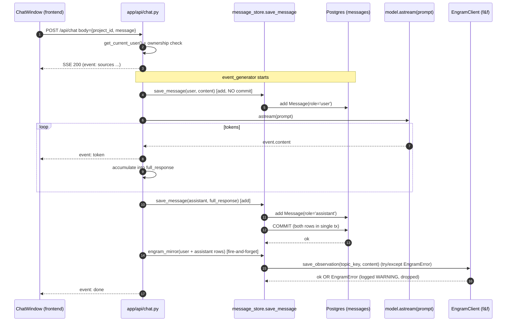
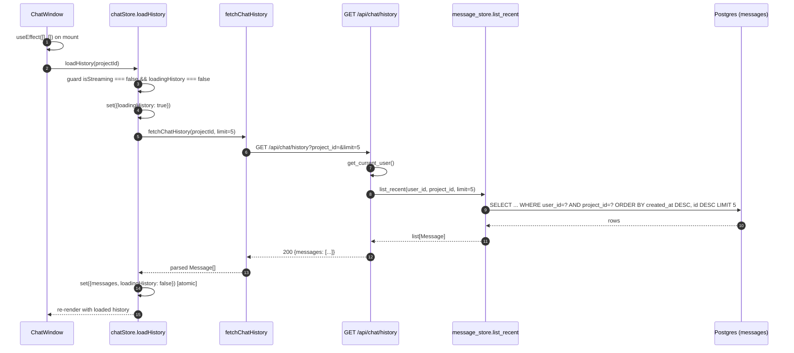
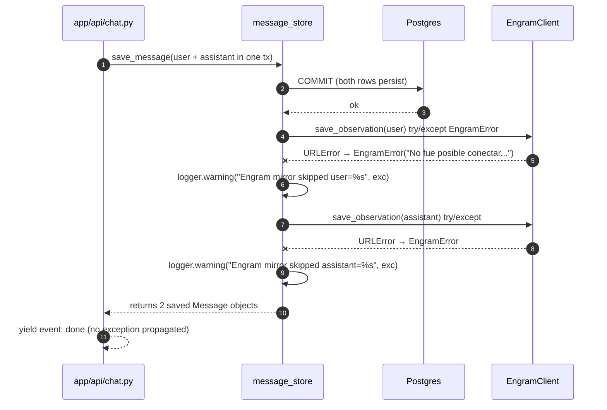
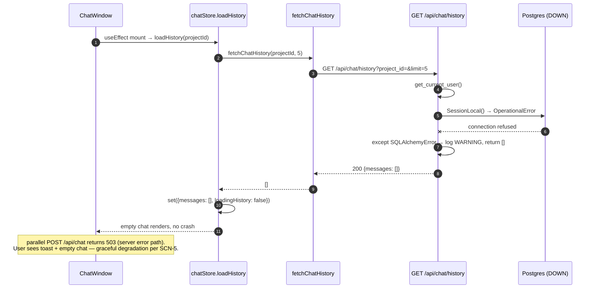

# Design: F12 — Engram MCP (Memoria + Historial de Chat)

| Field | Value |
|---|---|
| Change slug | `F12-engram-mcp` |
| Capability (NEW) | `engram-conversation-memory` → `openspec/specs/engram-conversation-memory/spec.md` |
| Branch | `feature/F12-engram-mcp` |
| Base | `origin/development` @ `d139c9e` (PR #64 MERGED) |
| HEAD | `bec064f` (F12 spec, this design extends it) |
| Proposal | `openspec/changes/F12-engram-mcp/proposal.md` @ `1cfcbc1` · Engram `sdd/F12-engram-mcp/proposal` |
| Exploration | `openspec/changes/F12-engram-mcp/explore.md` @ `8ae860f` · Engram `sdd/F12-engram-mcp/explore` |
| Spec | `openspec/specs/engram-conversation-memory/spec.md` @ `bec064f` · Engram `sdd/F12-engram-mcp/spec` (13 REQ, 8 SCN) |
| ADR | ADR-011 `docs/adr/011-engram-conversation-mirror.md` @ `1cfcbc1`; context ADR-005 @ `d139c9e` |
| Issue | [#14](https://github.com/danielCH26/arch-agent/issues/14) |
| Engram topic_key | `sdd/F12-engram-mcp/design` |
| Chained-PR strategy | Stacked-to-main (3 slices — F12.1 → F12.2 → F12.3) |
| Total forecast | ≈880 LoC across backend + frontend + tests |

---

## 1. Architecture overview

`POST /api/chat` becomes a thin orchestrator over the existing LLM stream: it streams the model output as before, but **before** yielding `event: done`, it commits both rows (`role=user`, `role=assistant`) inside one Postgres transaction against the new `Message` table and then fires a best-effort Engram mirror. `GET /api/chat/history?project_id=&limit=` is a new endpoint that reads the same table chronologically. The frontend `ChatWindow` mounts and pulls the last N turns into the Zustand `chatStore` before the user types — guarded so it never clobbers an in-flight stream. Postgres stays the source of truth for retrieval; Engram stays the semantic substrate for cross-session recall (ADR-011).

```text
                           arch-agent F12 boundary
  ┌────────────────────────────────────────────────────────────────────┐
  │                                                                    │
  │  ┌──────────────────────────┐         ┌──────────────────────────┐  │
  │  │  frontend ChatWindow.tsx │ ──GET──►│  GET /api/chat/history   │  │
  │  │  useEffect on mount      │  /hist  │  app/api/chat.py (NEW)   │  │
  │  │  loadHistory(projectId)  │ ◄─JSON──│  → MessageStore.list_   │  │
  │  │  (isStreaming guard)     │         │     recent(5..50)        │  │
  │  └──────────────────────────┘         └────────────┬─────────────┘  │
  │           ▲                                        │                │
  │           │ SSE                                    ▼                │
  │  ┌──────────────────────────┐         ┌──────────────────────────┐  │
  │  │  POST /api/chat          │ ◄─POST──│  app/api/chat.py (MOD)   │  │
  │  │  event_generator:        │ ──SSE──►│  sources → token* → done │  │
  │  │   save(user)+save(asst)  │         │                          │  │
  │  │   in ONE tx BEFORE done  │         │  app/core/message_store  │  │
  │  └──────────────────────────┘         │  - save_message()        │  │
  │                                       │  - list_recent()         │  │
  │                                       │  - engram_mirror() (f&f) │  │
  │                                       └──────┬─────────────┬─────┘  │
  │                                              │             │        │
  │                                  ┌───────────▼──────┐  ┌───▼─────┐  │
  │                                  │ Postgres         │  │ Engram  │  │
  │                                  │ messages (NEW)   │  │ HTTP v2 │  │
  │                                  │ (source of       │  │ /observa│  │
  │                                  │  truth)          │  │ tions   │  │
  │                                  └──────────────────┘  └─────────┘  │
  └────────────────────────────────────────────────────────────────────┘
```

---

## 2. Component inventory

| File | Action | Purpose | Key imports | LoC |
|---|---|---|---|---|
| `C:\Users\danie\Downloads\arch-agent\app\models\message.py` | Create | SQLAlchemy 2.0 `Message` ORM (REQ-2). | `sqlalchemy`, `app.core.database.Base` | ~30 |
| `C:\Users\danie\Downloads\arch-agent\app\models\__init__.py` | Modify | Register `Message` so `Base.metadata` sees it. | existing | +1 |
| `C:\Users\danie\Downloads\arch-agent\app\core\message_store.py` | Create | `save_message`, `list_recent`, `engram_mirror`, lazy `UserSession` upsert. | `app.core.database.SessionLocal`, `app.models.message.Message`, `app.models.session.UserSession`, `app.core.engram_client.EngramError` | ~95 |
| `C:\Users\danie\Downloads\arch-agent\app\core\engram_client.py` | Modify | Add 4 methods: `search`, `get_observation`, `save(topic_key)`, `delete(observation_id)`; raise `ValueError` on missing `project` in `search`. | `urllib`, `app.core.engram_client` self | +80 |
| `C:\Users\danie\Downloads\arch-agent\app\api\chat.py` | Modify | Wrap `event_generator` to insert both rows in one tx before `yield done`; add `GET /api/chat/history`. | `app.core.message_store`, `app.api.dependencies` | +90 |
| `C:\Users\danie\Downloads\arch-agent\migrations\0008_add_messages_table.sql` | Create | Idempotent `CREATE TABLE IF NOT EXISTS` + indexes + FK constraints (REQ-1, REQ-8). | (raw SQL) | ~50 |
| `C:\Users\danie\Downloads\arch-agent\schema.sql` | Modify | Mirror the new table + indexes for greenfield DBs. | (raw SQL) | +50 |
| `C:\Users\danie\Downloads\arch-agent\tests\core\test_message_store.py` | Create | Unit tests (SQLite in-memory) covering REQ-3, SCN-3, SCN-6 cross-user. | `pytest`, `sqlalchemy`, `app.core.message_store` | ~80 |
| `C:\Users\danie\Downloads\arch-agent\tests\test_engram_client.py` | Modify | Cover the 4 new `EngramClient` methods; assert REQ-5 `ValueError` on missing `project`. | `unittest.mock`, `app.core.engram_client` | +40 |
| `C:\Users\danie\Downloads\arch-agent\tests\api\test_chat.py` | Modify | Extend with REQ-4 + SCN-1 + SCN-4 + SCN-7 (commit-before-yield + Engram-down path). | `pytest`, `unittest.mock` | +50 |
| `C:\Users\danie\Downloads\arch-agent\tests\api\test_chat_history.py` | Create | Contract test for `GET /api/chat/history` covering REQ-7 + REQ-11 + SCN-3 + SCN-5. | `pytest`, FastAPI `TestClient` | ~140 |
| `C:\Users\danie\Downloads\arch-agent\tests\test_llm_validator.py` | Modify | Mock the 4 new `EngramClient` methods on the existing `MagicMock` (REQ-12 — already-anticipated calls at lines 170, 178, 197, 223). | `MagicMock` | +10 |
| `C:\Users\danie\Downloads\arch-agent\frontend\src\stores\chatStore.ts` | Modify | Add `loadHistory(projectId)` + `loadingHistory` flag + atomic `set({messages, loadingHistory:false})`. | `zustand`, `fetchChatHistory` | +40 |
| `C:\Users\danie\Downloads\arch-agent\frontend\src\api\chat.ts` | Modify | Add `fetchChatHistory(projectId, limit)` returning parsed `Message[]`. | `authStore` | +30 |
| `C:\Users\danie\Downloads\arch-agent\frontend\src\components\ChatWindow.tsx` | Modify | `useEffect(..., [])` invokes `loadHistory` with `isStreaming === false && loadingHistory === false` guard. | `useEffect`, `chatStore` | +20 |
| `C:\Users\danie\Downloads\arch-agent\frontend\src\stores\__tests__\chatStore.test.ts` | Create | Vitest: `loadHistory` sets `loadingHistory`, replaces `messages` atomically, clears on error (REQ-8). | `vitest`, `zustand` | ~50 |
| `C:\Users\danie\Downloads\arch-agent\frontend\src\components\__tests__\ChatWindow.test.tsx` | Create | Vitest: mount-time fetch fires once under StrictMode; in-flight stream not clobbered (REQ-9 + SCN-2). | `vitest`, `@testing-library/react` | ~50 |

**Forecast total: ≈860 LoC** (under the ≈900 ceiling). Slice budgets: F12.1 ≈360 · F12.2 ≈340 · F12.3 ≈160.

---

## 3. Sequence diagrams

### SD-1 — `POST /api/chat` happy path (commit-before-yield)



### SD-2 — `GET /api/chat/history` on page reload



### SD-3 — Engram unreachable + Postgres up



### SD-4 — Both stores unreachable



---

## 4. Data model — `messages` table

```text
┌──────────────────┐         ┌──────────────────┐
│   sessions       │         │   messages (NEW) │
│   (existing)     │  1   N  │                  │
│──────────────────│◄────────│──────────────────│
│ id PK            │ CASCADE │ id BIGSERIAL PK  │
│ user_id UQ FK    │         │ session_id FK ──►│ ON DELETE CASCADE
│ project_id FK    │         │ project_id FK ──►│ projects.id  ON DELETE SET NULL
│ active_phase     │         │ user_id FK    ──►│ users.id     ON DELETE CASCADE
│ engram_state JSON│         │ role CHECK IN    │ ('user','assistant','system')
│ last_seen_at     │         │ content TEXT     │ NOT NULL
│ created_at       │         │ citations JSONB  │ DEFAULT '[]'
│ updated_at       │         │ engram_obs_id    │ BIGINT NULL (mirror cross-ref)
└──────────────────┘         │ created_at TIMESTAMPTZ NOT NULL DEFAULT now()
                             │ updated_at TIMESTAMPTZ NOT NULL DEFAULT now()
┌──────────────────┐         └──────────────────┘
│   projects       │                  ▲
│──────────────────│──────────────────┘ ON DELETE SET NULL
│ id PK            │
│ user_id FK       │
│ ...              │
└──────────────────┘
                              Indexes:
                                idx_messages_session_id_created_at (session_id, created_at DESC, id DESC)
                                idx_messages_user_id_project_id  (user_id, project_id, created_at DESC)
```

Notes:

- `session_id` FK is the **existing per-user** `UserSession.id` (sessions table has `unique=True` on `user_id` per `app\models\session.py:8`). F12 must lazy-upsert a `UserSession` row on first message for that user (`message_store.save_message` is responsible). This keeps ADR-011's "per-(user, project) **Engram key**" naming (`arch-agent-user-{u}-project-{p}-chat`) independent of the Postgres FK semantics.
- `engram_observation_id BIGINT NULL` is a best-effort back-pointer; populated only when the Engram mirror succeeds. SCN-4 leaves it NULL.
- `citations JSONB DEFAULT '[]'` replaces the proposal's `sources_json` name to match the spec REQ-1 wording verbatim. The Python side accepts the kwarg `citations=` and serialises to JSONB.

---

## 5. API surface

| Endpoint | Status | Auth | Body / Query | Response | Notes |
|---|---|---|---|---|---|
| `POST /api/chat` | MODIFIED | Bearer JWT (existing `get_current_user`) | `{project_id: int|null, message: str}` | `200 text/event-stream` (sources → token* → done) **or** `503` if Postgres unreachable, `409`/`500` per existing rules | Behavior change: insert both `Message` rows in one Postgres tx BEFORE `event: done`; fire-and-forget Engram mirror AFTER commit. No new SSE event names. |
| `GET /api/chat/history` | NEW | Bearer JWT | `?project_id=<int>&limit=<int:1..50,default=5>` | `200 {messages: [{role, content, citations, created_at}, ...]}` newest-first · `403` cross-user · `404` unknown project · `200 []` if DB down (graceful) | Scopes by `user_id` AND `project_id`; cross-user returns 404 (do not leak existence) per REQ-7. |

No new headers; no SSE event-name additions; no breaking changes to existing `POST /api/chat` happy path.

---

## 6. Backend module design

```python
# app/models/message.py — REQ-2
class Message(Base):
    __tablename__ = "messages"
    id:                   int     # BIGSERIAL PK
    session_id:           int     # FK sessions.id  ON DELETE CASCADE  NOT NULL
    project_id:           int | None  # FK projects.id ON DELETE SET NULL
    user_id:              int     # FK users.id     ON DELETE CASCADE  NOT NULL
    role:                 str     # CHECK IN ('user','assistant','system')
    content:              str     # NOT NULL
    citations:            dict    # JSONB DEFAULT '{}'
    engram_observation_id: int | None  # BIGINT NULL
    created_at, updated_at: datetime   # TIMESTAMPTZ DEFAULT now()
```

```python
# app/core/message_store.py — REQ-3, REQ-6, REQ-10
def save_message(
    db: Session,
    *,
    session_id: int,
    project_id: int | None,
    user_id: int,
    role: Literal["user","assistant","system"],
    content: str,
    citations: dict | None = None,
) -> Message: ...

def list_recent(
    db: Session,
    *,
    user_id: int,
    project_id: int,
    limit: int = 5,
) -> list[Message]: ...       # ORDER BY created_at DESC, id DESC

def engram_mirror(message: Message, *, user_id: int, project_id: int) -> None:
    # fire-and-forget; catches EngramError, logs WARNING, never raises
    ...

def _ensure_user_session(db: Session, user_id: int) -> int:
    # Lazy-upsert UserSession row; returns sessions.id
    ...
```

```python
# app/core/engram_client.py — REQ-5 (extensions; existing methods untouched)
class EngramClient:
    def search(self, scope: str, query: str, project: str | None, user_id: int) -> list[dict]:
        if project is None:
            raise ValueError("project is required")     # SCN-6
        ...  # GET /observations?scope=...&project=...&user_id=...

    def get_observation(self, observation_id: int) -> dict: ...

    def save(self, topic_key: str, content: str, *, title: str = "", observation_type: str = "chat_message") -> dict:
        # Returns {"id": <int>} when accepted; raise EngramError on transport failure
        ...

    def delete(self, observation_id: int) -> None: ...
```

```python
# app/api/chat.py — MODIFIED event_generator + NEW history endpoint
@router.get("/history")                                  # NEW
def chat_history(project_id: int, limit: int = 5, current_user=Depends(get_current_user)):
    limit = max(1, min(50, limit))                       # REQ-7 clamp
    # verify project ownership → 404 cross-user
    # try: db query; except SQLAlchemyError: return {messages: []}     # REQ-11
    ...

async def chat(body, current_user):                       # MODIFIED event_generator
    async def event_generator():
        try:
            docs, rag_context = await retrieve_context()
            yield "event: sources ..."

            db = SessionLocal()
            try:
                _ensure_user_session(db, user_id)         # lazy
                user_msg = Message(role="user", ...)
                db.add(user_msg)

                full = ""
                async for event in model.astream(prompt):
                    if event.content:
                        full += event.content
                        yield "event: token ..."

                asst_msg = Message(role="assistant", content=full, ...)
                db.add(asst_msg)
                db.commit()                                # REQ-4 commit-before-yield
                engram_mirror(user_msg, user_id=user_id, project_id=body.project_id)
                engram_mirror(asst_msg, user_id=user_id, project_id=body.project_id)
                yield "event: done"
            finally:
                db.close()
        except Exception as e:
            yield "event: error ..."
```

---

## 7. SSE event contract — UNCHANGED

| Event | Direction | Payload | Change |
|---|---|---|---|
| `sources` | server → client | `JSON: RagSource[]` | unchanged |
| `token` | server → client | `JSON: string` (delta) | unchanged |
| `done` | server → client | `null` | **persistence commits before this yield** (REQ-4); event-name and payload unchanged |
| `error` | server → client | `JSON: string` | unchanged |

No new event names; no payload-shape changes. Frontend `frontend\src\api\chat.ts:27-76` (`dispatchSSEEvent`) needs no edits.

---

## 8. Migration strategy — `migrations\0008_add_messages_table.sql` + `schema.sql` mirror

Idempotent `CREATE TABLE IF NOT EXISTS` + `ADD CONSTRAINT IF NOT EXISTS` (Postgres 9.5+). Pattern mirrors `migrations\0003_sync_sessions_table.sql` and the `IF NOT EXISTS` precedent in `schema.sql` lines 52, 109-122.

- Migration applies to existing DBs via `python migrations\run_migrations.py` (runner already idempotent via `schema_migrations` table).
- `schema.sql` mirrors the same `CREATE TABLE` block so greenfield `init_db.py` runs include the table without needing the migration runner.
- **No backward migration.** Rollback per ADR-011 = drop the table (manual `DROP TABLE messages;` is safe; nothing else references it). REQ-1 CHECK + FK constraints drop with the table.
- Indexes: `(session_id, created_at DESC, id DESC)` for `list_recent`; `(user_id, project_id, created_at DESC)` for ownership-scoped fetches.

---

## 9. Error handling and resilience

| Scenario | Surface | Response | Log |
|---|---|---|---|
| Engram `URLError` / timeout on `save_observation` | `POST /api/chat` | Continue; both Postgres rows already committed; user gets normal SSE stream | WARNING: "Engram mirror skipped message=<id>: <exc>" |
| Engram down for entire session | `GET /api/chat/history` | No effect — read path does not call Engram | n/a |
| Postgres `OperationalError` on `POST /api/chat` (DB down) | server | Return `503 Service Unavailable`; do NOT emit SSE | ERROR: "messages insert failed" |
| Postgres `OperationalError` on `GET /api/chat/history` | server | Return `200 {"messages": []}` (graceful, per REQ-11 / SCN-5) | WARNING: "history read skipped, Postgres unreachable" |
| `CREATE TABLE IF NOT EXISTS` on a DB where the table already exists | migration runner | No-op (idempotent); `run_migrations.py` already records applied filename | n/a |
| Race: two requests create `UserSession` simultaneously | `save_message` | First `INSERT` wins; second `INSERT` raises `IntegrityError` (unique `user_id`) → catch + re-`SELECT` → use existing `sessions.id` | DEBUG |
| FK violation when `projects.id` is deleted while messages reference it | `Message.project_id ON DELETE SET NULL` | Project_id becomes NULL; row stays (REQ-1) | n/a |
| FK violation when `users.id` is deleted | `ON DELETE CASCADE` | Messages deleted with the user (REQ-1) | n/a |
| Invalid `limit` on `GET /api/chat/history` (negative, non-int, >50) | request validation | `limit = max(1, min(50, int(limit)))` clamp; FastAPI 422 on non-int | n/a |
| Cross-user `GET /api/chat/history?project_id=X` where X belongs to another user | server | `404` (not 403, to avoid leaking existence) per REQ-7 | n/a |
| `engram_client.search(project=None)` | direct call | Raises `ValueError("project is required")` (REQ-5, SCN-6) | n/a |

---

## 10. ADRs to add

**ADR-011 — already in tree at `docs\adr\011-engram-conversation-mirror.md` (commit `1cfcbc1`).** Covers: hybrid storage, fire-and-forget mirror, `session_id` scope, retrieval via Postgres, graceful degradation. **No new ADR required for F12 scope.**

`ADR-012` (session_id scope, listed OPTIONAL in proposal §13) is **deferred** — the decision is small enough to live in ADR-011 and the spec REQ-1; promoting to its own ADR adds no review value.

---

## 11. PR #64 dependency map

| Dependency | State at HEAD `bec064f` | Impact on F12 |
|---|---|---|
| **PR #64** — Pipeline RAG + PGVector | MERGED at `d139c9e` | Provides the Postgres instance (`docs\adr\002-postgres-pgvector.md`) that hosts the new `messages` table. `app\core\database.py::SessionLocal` and `engine` are reused unchanged. |
| **F11 PRs #69–74** — LangChain agent runtime, Context7 MCP, Langfuse tracer | OPEN, NOT merged | F12 is **independent**. `app\api\chat.py` still uses `model.astream(prompt)` directly (no LangChain agent); F12's persistence layer slots between `model.astream` and the SSE yield without awaiting F11. Spec §"Out of Scope" + proposal §4 confirm. |
| **Engram runtime** | Live container `engram` + `engram-proxy` socat, `:7437`/`:7439`, v2.0.0-rc.6 | `app\core\engram_client.py:17` already wires `ENGRAM_URL`; F12 adds 4 methods but does not change container config. |
| **Existing migrations** | `0001…0007` applied | F12 adds `0008`; `run_migrations.py` picks it up. No rollback concern. |

F12's branch is built directly on `origin/development @ d139c9e`; apply-phase operates on that base.

---

## 12. Chained-PR readiness — 3 slices (stacked-to-main)

| Slice | Title | LoC forecast | Files (new) | Files (modified) | Behaviour change? | PR target base |
|---|---|---|---|---|---|---|
| **F12.1** | Backend foundation (inert) | ~360 | `app\models\message.py`, `app\core\message_store.py`, `migrations\0008_add_messages_table.sql`, `tests\core\test_message_store.py` | `app\models\__init__.py`, `app\core\engram_client.py` (4 methods), `schema.sql`, `tests\test_engram_client.py` | **NO** — `chat.py` untouched; new code inert until F12.2 wires it. | branch `feature/F12-engram-mcp` → `origin/development` |
| **F12.2** | Chat integration + history endpoint | ~340 | `tests\api\test_chat_history.py` | `app\api\chat.py` (event_generator tx + GET history), `tests\api\test_chat.py` (commit-before-yield + Engram-down path), `tests\test_llm_validator.py` (4 mock methods) | **YES** — `POST /api/chat` now persists; new `GET /api/chat/history` endpoint. | branch off F12.1 → `origin/development` |
| **F12.3** | Frontend persistence | ~160 | `frontend\src\stores\__tests__\chatStore.test.ts`, `frontend\src\components\__tests__\ChatWindow.test.tsx` | `frontend\src\stores\chatStore.ts`, `frontend\src\api\chat.ts`, `frontend\src\components\ChatWindow.tsx` | **YES** — `ChatWindow` mount fetches history; reload restores messages. | branch off F12.2 → `origin/development` |

**Chain context** (each PR body must include):

```text
main ← F12.1 (foundation) ← F12.2 (BE change on /api/chat + new GET) ← F12.3 (frontend)
                              📍 varies per PR
```

Each PR ≤400 changed lines (chained-pr hard rule); F12.2 is the heaviest at ~340 LoC and stays under the budget. F12.3 can fold into F12.2 only if its diff stays <400 (deferred decision to `sdd-tasks`).

---

## 13. Test strategy — per REQ / SCN map

| Test file (absolute path) | Targets | Approach |
|---|---|---|
| `C:\Users\danie\Downloads\arch-agent\tests\core\test_message_store.py` | **REQ-3**, **SCN-3** (default N=5), **SCN-6** cross-user isolation | SQLite in-memory + `pytest` fixtures; assert `list_recent` order, limit clamp, scope by `user_id` + `project_id`. |
| `C:\Users\danie\Downloads\arch-agent\tests\api\test_chat_history.py` | **REQ-7**, **REQ-11**, **SCN-3**, **SCN-5**, **SCN-6** 404 cross-user | FastAPI `TestClient` against the app; mock `SessionLocal` to inject SQLite + raise `OperationalError` for the DB-down case. |
| `C:\Users\danie\Downloads\arch-agent\tests\api\test_chat.py` | **REQ-4**, **REQ-6**, **REQ-10**, **SCN-1**, **SCN-4**, **SCN-7** | Mock `model.astream` to emit 3 tokens; assert SSE order, that DB `commit` is called BEFORE `event: done` yield (use side-effect counter + sentinel), and that `EngramError` does not raise to caller. |
| `C:\Users\danie\Downloads\arch-agent\tests\test_engram_client.py` | **REQ-5**, **SCN-6** | `unittest.mock.patch('app.core.engram_client.urlopen')`; assert `search(project=None)` raises `ValueError`; assert `save(topic_key=…)` sends body containing `topic_key` + `scope=project`. |
| `C:\Users\danie\Downloads\arch-agent\tests\test_llm_validator.py` | **REQ-12** | Existing `MagicMock` already has `search`/`get_observation` injected (lines 140, 159, 178); F12.2 only needs to ensure `save`/`delete` are also on the mock (no signature changes to existing tests). |
| `C:\Users\danie\Downloads\arch-agent\frontend\src\stores\__tests__\chatStore.test.ts` | **REQ-8** | Vitest + Zustand: `loadHistory(42)` sets `loadingHistory`, replaces `messages` atomically, leaves `messages` untouched on fetch error. |
| `C:\Users\danie\Downloads\arch-agent\frontend\src\components\__tests__\ChatWindow.test.tsx` | **REQ-9**, **SCN-2** | Vitest + `@testing-library/react`: assert `fetchChatHistory` called once on mount; double-render (StrictMode) does not double-fire; `isStreaming=true` blocks the fetch. |

No new fixture infrastructure required (`tests\api\conftest.py` already provides `TestClient` setup).

---

## 14. Out of scope (restated)

- MCP-stdio transport for the Engram client (would enable direct semantic search; not in F12).
- Cross-user memory sharing (REQ-7 + REQ-5 enforce strict `user_id` scoping).
- Auto-summarisation of long histories beyond last-N window (token-cost control per proposal §6 row 7).
- Switching the LLM tool surface to MCP (F11 territory).
- F11 LangChain agent runtime integration — PRs #69–74 remain OPEN; F12 is independent of them.
- `app\core\session_store.py` refactor (dead code) — deferred per ADR-011.
- `app\api\sse.py::SSEStreamCallbackHandler` dead construct (chat.py:121 today) — left as-is in F12; threading it into `model.astream` is a separate, optional refactor.
- Frontend virtualisation / pagination beyond `?limit=` parameter.

---

## 15. Risks (≥8, carried + new)

| # | Risk | Likelihood | Mitigation | Source |
|---|---|---|---|---|
| 1 | TTFT regression from synchronous per-message save before `event: done` | Med | Local socket ≤50 ms; benchmark in F12.2 PR; if >100 ms, fall back to fire-and-forget (spec REQ-4 requires commit-before-yield, so fallback means removing persistence on failure with WARNING log). | proposal §10 #10, new |
| 2 | Frontend StrictMode race in `loadHistory` clobbers in-flight tokens | Med | REQ-9 guard: `isStreaming === false && loadingHistory === false`; assert with Vitest that double-render fires `fetchChatHistory` only once. | explore §5 #6, spec SCN-2 |
| 3 | `tests\test_llm_validator.py` dormant imports on `search`/`get_observation`/`save`/`delete` | Med | REQ-12 closes the gap; mocks update to match new signatures in F12.2 (≤10 LoC). | explore §5 #9, proposal §10 #9 |
| 4 | Cross-user leakage via `engram_client.search` | Med | REQ-5 raises `ValueError` when `project` is None; SCN-6 cross-user test; client passes `project=user_id-prefix` (from `app\__init__.py:33-36 get_engram_project_key`). | explore §5 #3, spec SCN-6 |
| 5 | Migration drift between `schema.sql` and `migrations\0008` | Low | Mirror `CREATE TABLE` block verbatim in both files (REQ-1); runner is idempotent (re-running is a no-op). | proposal §10 #7, ADR-011 |
| 6 | Token growth in LLM context from last-N verbatim injection | Med | Hard cap N=5 default; `?limit=` max 50; long-range recall via `engram_client.get_context()` only on explicit request (proposal §6 row 7). | proposal §10 #8 |
| 7 | First-message `UserSession` lazy-upsert race (unique on `user_id`) | Low | `try INSERT; except IntegrityError → SELECT existing`; only the inner two-line block is racy. | new (derived from REQ-1 FK requirement) |
| 8 | Disconnect after Postgres commit but before `event: done` yield leaves the assistant row orphaned client-side | Low | Acceptable per spec §"Risks" #1 — the row surfaces on the next history call. Logging at INFO keeps the trace. | spec §"Risks" |
| 9 | `chat.py:121` `SSEStreamCallbackHandler` remains dead; tests keep passing either way | Low | Leave as-is in F12; fold into `model.astream(callbacks=...)` later if needed. | explore §5 #5 |
| 10 | `schema.sql` and `migrations\0008` go out of sync if a column is added later without mirroring | Low | Add a CI guard (`tests\test_schema_sync.py`) — **out of scope for F12**, document as future work in the migration file header comment. | new |

---

## 16. References

- Exploration — `openspec\changes\F12-engram-mcp\explore.md` @ `8ae860f` · Engram `sdd/F12-engram-mcp/explore` (#44) — 9 risks, 3 alternatives, v2.0.0-rc.6 endpoint probes.
- Proposal — `openspec\changes\F12-engram-mcp\proposal.md` @ `1cfcbc1` · Engram `sdd/F12-engram-mcp/proposal` (#45) — Hybrid storage decision + 8 ambiguities resolved + 3-slice chain.
- Spec — `openspec\specs\engram-conversation-memory\spec.md` @ `bec064f` · Engram `sdd/F12-engram-mcp/spec` (#46) — 13 REQ + 8 SCN.
- ADR-011 — `docs\adr\011-engram-conversation-mirror.md` @ `1cfcbc1` — Hybrid storage + fire-and-forget Engram mirror.
- ADR-005 — `docs\adr\005-engram-mcp.md` @ `d139c9e` — Engram as MCP of memory (context).
- ADR-002 — `docs\adr\002-postgres-pgvector.md` @ `d139c9e` — Postgres + PGVector as the single DB.
- Migration pattern — `migrations\0003_sync_sessions_table.sql` — idempotent ALTER TABLE + DO $$ guard; `migrations\run_migrations.py` (63 LoC) tracks applied filenames.
- Codebase anchors — `app\api\chat.py:155-188` (event_generator to wrap), `app\core\engram_client.py:1-65` (4 methods to extend), `app\models\session.py:1-14` (`UserSession` for lazy-upsert), `frontend\src\stores\chatStore.ts:1-152` (no `loadHistory` today), `frontend\src\components\ChatWindow.tsx:1-63` (no `useEffect` today), `frontend\src\api\chat.ts:78-157` (existing SSE dispatcher).
- Issue — [#14 — [F12] Engram MCP integrado (memoria)](https://github.com/danielCH26/arch-agent/issues/14).
- Tests — `tests\test_engram_client.py` (43 LoC, `urlopen` patched), `tests\api\test_chat.py` (109 LoC, no persistence), `tests\test_llm_validator.py:140,159,170,178,197,223` (forward-looking mocks).