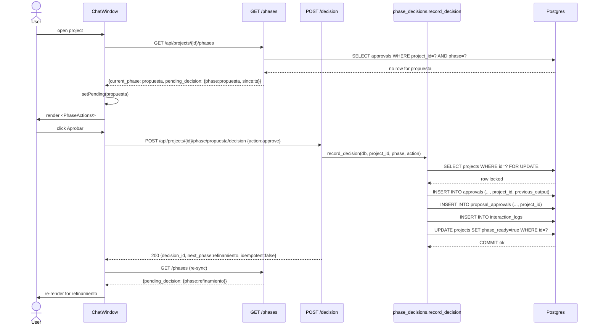
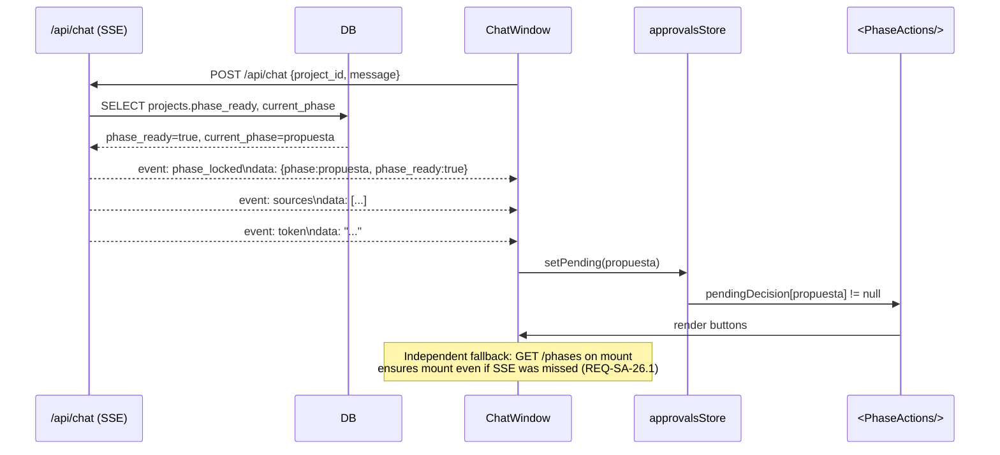
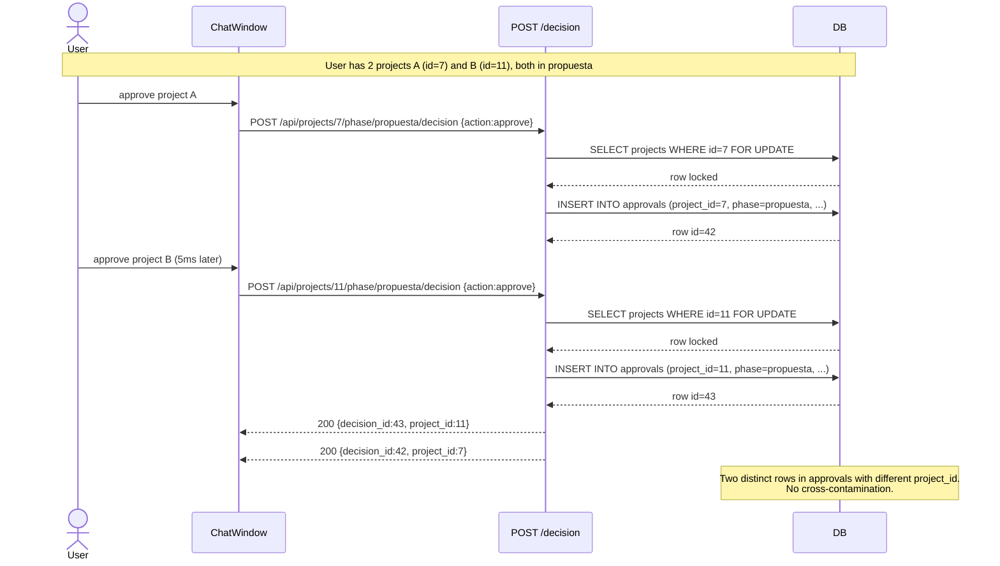
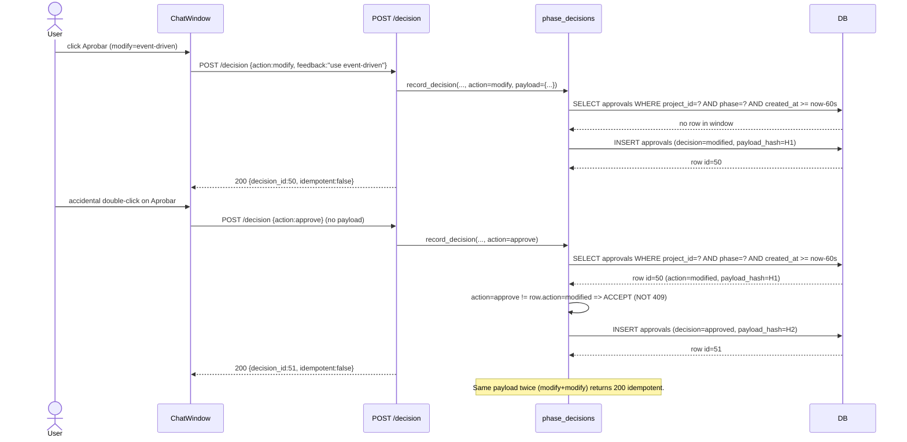
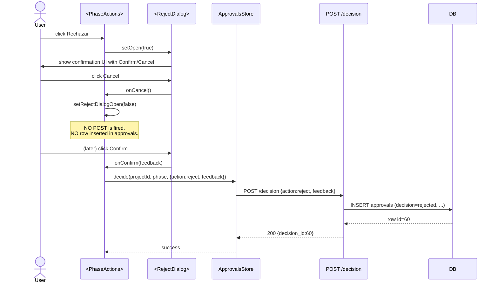

# Design: HU10 v2 — Per-stage approval gate with project scoping

> Change: `hu10-staged-approvals-v2`
> Supersedes: PR #78 (`feature/hu10-staged-approvals`, CHANGES_REQUESTED)
> Spec: `openspec/specs/staged-approvals/spec.md` (canonical REQ-SA-1..36)
> ADR: `docs/adr/015-hu10-phase-gate-v2.md` (successor to ADR-014)

## Goals

- Close the 4 PR #78 blockers as formal requirements (REQ-SA-26..29).
- Close the 7 important findings (REQ-SA-30..36).
- Keep change scope-bounded: HU10 only; no F13/F12/F11/migration renumber drift.
- Single PR <=800 changed lines OR a chained-PR plan documented before apply.
- v2 branches from `development` (NOT from PR #78 head, NOT from `main`).

## Non-Goals

- F05/F08 refactor beyond de-conflicting `phase_ready` writes (REQ-SA-36).
- Migration renumber cleanup (`0007..0016` sequence retained).
- Multi-user concurrent approval, RBAC, audit log UI, notification hooks.
- Deprecation of `proposal_approvals` mirror table (kept for F08 reader compat).

## Architecture Overview

HU10 v2 is the **single canonical writer** of `approvals` rows for 4 of the 5 phases. F05 retains ownership of `requerimientos` (already wired in `app/api/elicitation.py:211`). Components:

- **Backend domain helper** `app/core/phase_decisions.py` — owns `(project_id, phase)` filtering, `SELECT FOR UPDATE` on the `projects` row, payload-hash idempotency, typed 409 body shape.
- **Backend endpoints** `app/api/projects.py` — `GET /api/projects/{id}/phases` (returns `pending_decision`); `POST .../phase/{phase}/decision` (typed 409).
- **Backend migration** `migrations/0017_add_project_id_to_approvals.sql` — idempotent column add, backfill, index.
- **Frontend store** `frontend/src/stores/approvalsStore.ts` — derives `pendingDecision` from `phases` response; reads `err.data.detail.*` on conflict (REQ-SA-29).
- **Frontend component** `frontend/src/components/PhaseActions/PhaseActions.tsx` — fixed Tailwind class (`text-white`); drop `window.prompt`.
- **New frontend component** `frontend/src/components/PhaseActions/RejectDialog.tsx` — inline confirmation modal.
- **Frontend client** `frontend/src/api/phases.ts` — typed `getPhases(projectId)`.

### Single-Owner Table

| Phase | Owner | Endpoint | Why |
|---|---|---|---|
| `requerimientos` | F05 | `/api/projects/{id}/elicitation/decision` | F05 already writes `approvals` + flips `phase_ready`; re-prompt on modify via existing elicit flow |
| `propuesta` | HU10 | `/api/projects/{id}/phase/propuesta/decision` | Dual-write to `proposal_approvals` preserved (REQ-PA-HU10-6) |
| `refinamiento` | HU10 | `/api/projects/{id}/phase/refinamiento/decision` | LLM-generated Mermaid; modify = re-prompt |
| `revision` | HU10 | `/api/projects/{id}/phase/revision/decision` | Direct UI edit; modify = apply edit (REQ-SA-7, REQ-SA-33) |
| `final` | HU10 | `/api/projects/{id}/phase/final/decision` | Binary sign-off; no Modify button (REQ-SA-8) |

`/advance` MUST verify the HU10 approval record for HU10-owned phases (REQ-SA-36):

```python
def advance_phase(db, project_id):
    project = db.get(Project, project_id)
    if PHASE_OWNER[project.current_phase] == "HU10":
        approval = db.execute(
            select(Approval).where(
                Approval.project_id == project_id,
                Approval.phase == project.current_phase,
                Approval.decision.in_(["approved", "approve"]),
            ).order_by(Approval.created_at.desc())
        ).scalar_one_or_none()
        if not approval:
            raise PhaseNotApprovedError(...)  # 409
    # ... advance logic
```

## Sequence Diagrams

### Sequence 1: User approves a phase end-to-end



### Sequence 2: Backend emits `event: phase_locked` and frontend consumes it



### Sequence 3: Cross-project isolation (REQ-SA-27)



### Sequence 4: Concurrency / double-click (REQ-SA-31)

```mermaid
sequenceDiagram
    participant Req1 as POST /decision #1
    participant Req2 as POST /decision #2
    participant DB

    Note over Req1,Req2: Two concurrent requests arrive within 5ms for the same project
    par Request #1
        Req1->>DB: BEGIN; SELECT projects WHERE id=7 FOR UPDATE
        DB-->>Req1: row locked by #1
    and Request #2
        Req2->>DB: BEGIN; SELECT projects WHERE id=7 FOR UPDATE
        DB-->>Req2: BLOCKED waiting on lock
    end
    Req1->>DB: INSERT INTO approvals (..., action=approve)
    Req1->>DB: UPDATE projects SET phase_ready=true
    Req1->>DB: COMMIT
    DB-->>Req2: lock released
    Req2->>DB: SELECT projects WHERE id=7 (no lock needed now)
    DB-->>Req2: row (phase_ready=true)
    Req2->>DB: SELECT approvals WHERE project_id=7 AND phase=requerimientos AND created_at >= now-60s
    DB-->>Req2: existing decision found (action=approve)
    Req2->>DB: ROLLBACK (no INSERT)
    Req2-->>Req1: 409 {detail:{current_decision:approve, decided_at:ts, current_phase:requerimientos}}
    Req1-->>Req1: 200 {decision_id:42, idempotent:false}
```

### Sequence 5: Idempotent retry (REQ-SA-30)



### Sequence 6: Reject dialog cancel (REQ-SA-32)



## Data Model

### Migration `0017_add_project_id_to_approvals.sql`

```sql
-- Idempotent + additive. NO destructive ops (REQ-SA-27).
ALTER TABLE approvals
    ADD COLUMN IF NOT EXISTS project_id INTEGER
    REFERENCES projects(id) ON DELETE CASCADE;

-- Backfill from sessions.project_id for existing approval rows.
-- Rows without a resolvable session keep NULL (logged warning, manual triage).
UPDATE approvals a
SET project_id = s.project_id
FROM sessions s
WHERE a.session_id = s.id
  AND a.project_id IS NULL;

-- After backfill the column is NOT NULL. We DON'T drop nullability in the
-- migration to keep rollback trivial (a single DROP COLUMN); application-layer
-- validation in record_decision enforces non-null writes from now on.
-- (Future migration 0018+ may add NOT NULL once orphan triage is complete.)

-- Create index for the (project_id, phase, created_at) hot path
-- (REQ-SA-18). Replaces the v1 session-scoped index from migration 0015.
CREATE INDEX IF NOT EXISTS ix_approvals_project_phase_created
    ON approvals (project_id, phase, created_at DESC);

-- Drop the v1 session-scoped index (replaced).
DROP INDEX IF EXISTS idx_approvals_session_phase_created;
```

**Why idempotent, additive**: re-runs of `setup-local.sh` must be safe. **Why `ON DELETE CASCADE`**: deleting a project removes its approval history (matches `proposal_approvals` policy). **Why `(project_id, phase, created_at DESC)`**: hot read path is "latest decision for (project, phase)". **Why drop the session index**: it cross-contaminates since `sessions.user_id` is UNIQUE (one session per user).

### `app/models/approval.py` extension

```python
class Approval(Base):
    __tablename__ = "approvals"

    id: Mapped[int] = mapped_column(primary_key=True)
    session_id: Mapped[int] = mapped_column(
        ForeignKey("sessions.id", ondelete="CASCADE"),
        nullable=False,
    )
    # HU10 v2 (REQ-SA-27): project_id added in migration 0017.
    project_id: Mapped[int] = mapped_column(
        ForeignKey("projects.id", ondelete="CASCADE"),
        nullable=True,  # nullable at the DB level; record_decision enforces non-null writes
        index=True,
    )
    phase: Mapped[str] = mapped_column(String(50), nullable=False)
    feedback: Mapped[str] = mapped_column(Text, nullable=True)
    previous_output: Mapped[dict] = mapped_column(JSONB, nullable=False, default=dict)
    created_at: Mapped[datetime] = mapped_column(server_default=func.now())
```

### `app/core/phase_decisions.py` rewrite

```python
def record_decision(
    db: Session,
    project_id: int,
    phase: str,
    action: Literal["approve", "modify", "reject"],
    *,
    feedback: Optional[str] = None,
    payload: Optional[dict] = None,
    idempotency_key: Optional[str] = None,
) -> PhaseDecisionResult:
    # 1. Validate phase in AVAILABLE_PHASES.
    # 2. Validate action in VALID_ACTIONS; modify requires feedback.
    # 3. Load + LOCK project row (REQ-SA-31).
    project = db.execute(
        select(Project).where(Project.id == project_id).with_for_update()
    ).scalar_one_or_none()
    if project is None: raise ProjectNotFound(project_id)
    # 4. Enforce phase == current_phase (REQ-SA-28).
    if phase != project.current_phase:
        raise PhaseMismatchError(current_phase=project.current_phase, requested_phase=phase)
    # 5. Derive idempotency_key from (action, payload) if not provided (REQ-SA-30).
    key = idempotency_key or _derive_key(action, payload or {})
    # 6. Look up recent decision (project_id, phase, created_at >= now-60s, payload_hash=key).
    recent = db.execute(
        select(Approval).where(
            Approval.project_id == project_id,
            Approval.phase == phase,
            Approval.created_at >= datetime.utcnow() - timedelta(seconds=60),
        ).order_by(Approval.created_at.desc())
    ).scalars().first()
    if recent is not None and _hash(recent) == key:
        # Identical retry: return 200 idempotent.
        return PhaseDecisionResult(..., idempotent=True)
    # 7. Build previous_output snapshot.
    # 8. INSERT into approvals (with project_id, payload_hash=key).
    # 9. For propuesta: dual-write to proposal_approvals (project_id, previous_output).
    # 10. INSERT into interaction_logs.
    # 11. UPDATE projects.phase_ready (approve=true, reject=false, modify=unchanged).
    # 12. COMMIT (caller owns lifecycle).
```

**Lock order**: `SELECT ... FOR UPDATE` on `projects` first, then INSERT into `approvals`. The lock is held until COMMIT. **Why FOR UPDATE not FOR SHARE**: we need exclusive ownership of the (project, phase) decision slot during the transaction. **Why server-side key derivation**: clients may omit `idempotency_key`; the server derives `(action, sha256(payload))[:16]` for stable comparison.

## API Contract

### `GET /api/projects/{id}/phases`

Response (REQ-SA-12, REQ-SA-26):

```json
{
  "phases": [
    {"phase": "requerimientos", "status": "approved", "decided_at": "2026-09-27T22:00:00Z", "pending_decision": null},
    {"phase": "propuesta", "status": "ready", "decided_at": null, "pending_decision": {"phase": "propuesta", "since": "2026-09-27T22:01:00Z"}}
  ],
  "current_phase": "propuesta",
  "phase_ready": true,
  "pending_decision": {"phase": "propuesta", "since": "2026-09-27T22:01:00Z"}
}
```

**Why top-level `pending_decision`**: defense-in-depth alongside the per-phase items — `ChatWindow` reads top-level once on mount and again after every chat response.

### `POST /api/projects/{id}/phase/{phase}/decision`

Request body (REQ-SA-14):
```json
{"action": "approve", "feedback": null, "payload": null, "idempotency_key": null}
```

Success (200):
```json
{"decision_id": 42, "action": "approve", "phase": "propuesta", "project_id": 7, "next_phase": "refinamiento", "decided_at": "2026-09-27T22:01:00Z", "idempotent": false}
```

Conflict (409) — phase mismatch (REQ-SA-28):
```json
{"detail": {"error": "phase_mismatch", "current_phase": "requerimientos", "requested_phase": "refinamiento"}}
```

Conflict (409) — different-action in window (REQ-SA-9):
```json
{"detail": {"current_decision": "approve", "decided_at": "2026-09-27T22:00:00Z", "current_phase": "propuesta"}}
```

**FastAPI `detail` wrapping is mandatory**: frontend reads `err.data.detail.*` (REQ-SA-29). The `ApiConflictError` typed class (REQ-SA-34) carries `{current_decision, decided_at, current_phase}`.

## Frontend Contract

### `frontend/src/stores/approvalsStore.ts` — derive pendingDecision from `phases`

```typescript
// AFTER (v2):
fetchHistory: async (projectId) => {
  const response = await listPhases(projectId)
  // Derive pendingDecision from response.pending_decision (REQ-SA-26.1)
  // and from each phases[i].pending_decision (REQ-SA-12.1).
  const pending: Record<Phase, PendingDecision | null> = emptyPending()
  if (response.pending_decision) {
    pending[response.pending_decision.phase] = {phase: response.pending_decision.phase}
  }
  // ... sync historyByPhase from phases[i].current_decision ...
  set({phases: response.phases, currentPhase: response.current_phase, pendingDecision: pending, ...})
}

// Read conflict from err.data.detail.* (REQ-SA-29).
decide: async (projectId, phase, body) => {
  try { return await decidePhase(projectId, phase, body) }
  catch (err) {
    if (err instanceof ApiError && err.status === 409) {
      const detail = err.data?.detail ?? err.data  // tolerate both during deprecation
      throw new ApiConflictError(detail?.current_decision, detail?.decided_at, detail?.current_phase)
    }
    throw err
  }
}
```

### `frontend/src/components/PhaseActions/PhaseActions.tsx` — button class + reject dialog

```tsx
// BEFORE (v1 bug): bg-green-600 text  <-- missing text-white
// AFTER (v2):
<button className="flex-1 px-4 py-2 bg-green-600 text-white rounded hover:bg-green-700 disabled:bg-green-300">
  Aprobar
</button>

// BEFORE (v1 bug): window.prompt
// AFTER (v2):
<button onClick={() => setRejectDialogOpen(true)}>Rechazar</button>
{rejectDialogOpen && <RejectDialog onCancel={() => setRejectDialogOpen(false)} onConfirm={(fb) => onReject(fb)} />}
```

### New `frontend/src/components/PhaseActions/RejectDialog.tsx`

```tsx
interface RejectDialogProps {
  onCancel: () => void
  onConfirm: (feedback: string) => Promise<void>
}
export function RejectDialog({onCancel, onConfirm}: RejectDialogProps) {
  const [feedback, setFeedback] = useState('')
  const [busy, setBusy] = useState(false)
  return (
    <div role="dialog" data-testid="reject-dialog" className="...">
      <h3>Rechazar esta fase</h3>
      <textarea value={feedback} onChange={e => setFeedback(e.target.value)} />
      <button onClick={onCancel} disabled={busy}>Cancelar</button>  {/* No POST fires */}
      <button onClick={async () => { setBusy(true); await onConfirm(feedback) }} disabled={busy}>Confirmar rechazo</button>
    </div>
  )
}
```

### `frontend/src/components/ChatWindow.tsx` — mount from `/phases`

```tsx
// On mount AND after every chat response, refetch /phases so the
// pendingDecision is derived server-side (REQ-SA-26.1). The SSE
// `phase_locked` event is a parallel optimization (REQ-SA-26.2).
useEffect(() => { void fetchApprovalsHistory(projectId) }, [projectId])
// After fetchApprovalsHistory resolves, approvalsStore.phases + pendingDecision
// are populated, and the existing render gate (line 194) mounts <PhaseActions/>.
```

## Idempotency Contract

- **Key**: `key = SHA256(canonical_json({action, payload or {}}))[:16]`.
- **Retention**: 60s window (REQ-SA-10).
- **Behavior**:
  - Same `(project_id, phase, payload_hash)` within window -> return existing `decision_id` with `idempotent: true`.
  - Different `(action, payload_hash)` within window -> accept new decision (NOT 409).
  - Client-provided `idempotency_key` overrides server derivation when present.

**Why per-action-key**: unblocks legitimate `modify -> approve` flows (REQ-SA-30.2).

## Concurrency Contract

- All writes to `approvals` for a given `(project_id, phase)` MUST be serialized via `SELECT ... FOR UPDATE` on the `projects` row (REQ-SA-31).
- The lock is held until COMMIT (caller-managed transaction).
- Concurrency tests MUST run against Postgres (SQLite doesn't enforce row locks).

## Migration / Rollout

- Migration `0017` is idempotent + additive (see SQL above). Rollback = `ALTER TABLE approvals DROP COLUMN project_id; CREATE INDEX idx_approvals_session_phase_created ON approvals(session_id, phase, created_at DESC);`.
- All non-DB code reversible by reverting the single PR.
- No destructive schema drops, no data deletion, no `DROP CONSTRAINT` cascades.
- If `/phases` endpoint causes regressions, behind a feature flag `HU10_PHASES_ENABLED` — disabled by default during roll-out.

## Test Plan

- **Backend pytest**: each REQ has >=1 unit test. REQ-SA-31 has a Postgres-backed concurrency test (NOT SQLite). REQ-SA-27 has a 2-project cross-contamination integration test.
- **Frontend vitest**: each new component has component tests. REQ-SA-29 has an integration test against the real HTTP error body shape.
- **Manual smoke**: walk all 5 phases with real tool-calling LLM. Document in PR description.
- **Coverage**: `app/core/phase_decisions.py` >= 95% line coverage.

## Threat Matrix

N/A — no routing, shell, subprocess, VCS/PR automation, executable-file classification, or process-integration boundary introduced by this change.

## Work-Unit Commit Boundaries

Per `work-unit-commits` skill — split into reviewable work units. Each commit = 1 behavior with tests:

1. `migration(approvals): add project_id column + backfill + index` — migration 0017 + `Approval.project_id` model field.
2. `refactor(phase-decisions): project_id filter, FOR UPDATE, current_phase check, payload-hash idempotency` — `app/core/phase_decisions.py` rewrite + tests.
3. `feat(api): GET /phases includes pending_decision; POST /decision returns typed 409 with current_phase` — endpoint updates + tests.
4. `fix(frontend): approvalsStore reads err.data.detail.*; PhaseActions text-white; typed ApiConflictError` — frontend bug fixes + tests.
5. `feat(frontend): RejectDialog replaces window.prompt; ChatWindow derives pendingDecision from /phases` — new component + integration tests.
6. `docs(adr-015): record v2 contract — project_id ownership, race policy, idempotency, single-owner table` — ADR + spec provenance.

If forecast exceeds 800 changed lines, plan chains from `feature/hu10-tracker` (hub-and-spoke).

## Open Questions

- Should client-provided `idempotency_key` (header or body) be honored as a server fallback? **Recommendation**: honor when present; fall back to server derivation. Document header semantics in a follow-up.
- Should the deprecation alias `previous_output -> current_output` for `revision` last 1 release or 2? **Recommendation**: 1 release per REQ-SA-33.
- Should `/phases` return the full decision history or just `pending_decision`? **Recommendation**: just `pending_decision` + the per-phase `current_decision` (one per phase); history endpoint is a follow-up.
- Should F05's `requerimientos` write flow be migrated to call `record_decision`? **Recommendation**: NO (out of scope per proposal); F05 retains sole ownership for `requerimientos`.

## Files Affected

| File | Action | Description |
|---|---|---|
| `migrations/0017_add_project_id_to_approvals.sql` | Create | idempotent ADD COLUMN + backfill + INDEX |
| `app/models/approval.py` | Modify | add `project_id` FK + index |
| `app/core/phase_decisions.py` | Modify (rewrite) | project_id filter, FOR UPDATE, current_phase check, payload-hash idempotency, typed error |
| `app/api/projects.py` | Modify | `GET /phases` returns `pending_decision`; `POST /decision` typed 409 |
| `frontend/src/api/approvals.ts` | Modify | read `err.data.detail.*`; extend typed `ApiConflictError` |
| `frontend/src/api/phases.ts` | Create | typed `getPhases(projectId)` (NEW file or extend approvals.ts) |
| `frontend/src/stores/approvalsStore.ts` | Modify | derive `pendingDecision` from `/phases` response; use `ApiConflictError` |
| `frontend/src/components/PhaseActions/PhaseActions.tsx` | Modify | `text-white` Tailwind class; replace `window.prompt` |
| `frontend/src/components/PhaseActions/RejectDialog.tsx` | Create | inline confirmation modal |
| `frontend/src/components/ChatWindow.tsx` | Modify | mount `<PhaseActions/>` from `/phases` derived `pendingDecision` |
| `docs/adr/015-hu10-phase-gate-v2.md` | Create | successor to ADR-014 |